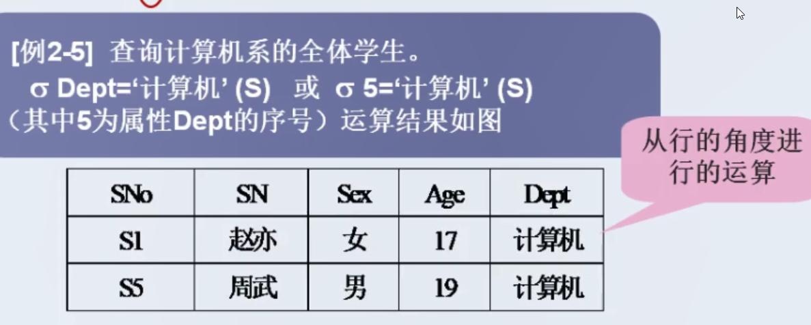

# 关系数据库与SQL语言

## 一、数据库系统概述

### 数据库系统中的基本概念

> ==Data==：（数据）它是描述客观事物的一种符号记录。
>
> ==DB==：（数据库）它是长期存储在计算机内的有组织、可共享的数据的集合。
>
> ==DBMS==：（数据库管理系统）它是管理数据库的一种应用软件。
>
> ==DBA==：（数据库管理员）它是数据库的管理员。
>
> ==DBS==：（数据库系统）时采用数据库技术的一种系统，它包含上述四个
>
> ==数据库系统==包括：DB、DBMS、DBA、应用系统

### 数据库技术的产生、发展

|    阶段    |  时间   |                             特点                             |
| :--------: | :-----: | :----------------------------------------------------------: |
|  人工管理  | 20C 50S |       不共享、不独立、数据不保存、使用应用程序管理数据       |
|  文件系统  | 20C 60S | 共享性、独立性差、数据可以长期保存、由文件系统管理数据、数据冗余大 |
| 数据库系统 | 20C 70S | 数据结构化、共享性高、冗余性低、独立性高、有统一的数据管理和控制功能 |

> 
>
> ==数据的独立性==是数据库系统的最基本的特征之一。 数据独立性是指应用程序和数据结构之间相互独立, 互不影响。 在三层模式体系结构中数据独立性是指数据库系统在某一层次模式上的改变不会使它的上一层模式也发生改变的能力。 ... 它能使数据独立于应用程序。
>
> ==数据一致性==就是当多个用户试图同时访问一个数据库，它们的事务同时使用相同的数据，可能会发生以下四种情况：丢失更新、未确定的相关性、不一致的分析和幻想读。

### 数据库管理系统（DBMS）

#### DBMS的主要功能

> 1. ==数据定义功能 & DDL==
>
>    用于改变数据库结构，包括创建、更改和删除数据库对象
>
> 2. ==数据操纵功能 & DML==
>
>    数据库的基本操作：检索、更新、增删改查等
>
> 3. ==数据控制功能 & DCL==
>
>    用来授予和撤销用户权限

### 数据库系统的三级模式

> 内模式：模式  1：1，它要保证数据的物理独立性
>
> 模式：外模式  1：N，它要保证数据的逻辑独立性。
>
> * ==外模式==
>
>   也称==用户模式==或==子模式==
>
>   数据库用户能看到并允许使用的那部分局部数据的逻辑结构和特征的描述（视图）
>
> * ==模式==
>
>   也称==概念模式==
>
>   数据库中全体数据的逻辑结构和特征的描述（基本表）
>
> * ==内模式==
>
>   也称==存储模式==
>
>   它是对数据库存储结构的描述；是数据在数据库内部的表示方式

### 数据模型

> 数据模型是数据库的框架
>
> 数据模型是数据库系统的核心和基础
>
> 是描述数据与数据之间的联系、数据的语义、数据一致性约束的概念性工具的集合。

#### 分类

> 1. ==概念数据模型（信息模型）==
>
>    面向用户的，按照用户的观点进行建模
>
>    典型代表：E-R图
>
> 2. ==结构数据模型==
>
>    面向计算机系统的，用于DBMS的实现
>
>    典型代表：层次模型，网状模型、关系模型、面向对象模型

##### 数据模型的三要素

> 1. ==数据结构==
>
>    创建数据库
>
> 2. ==数据操作==
>
>    创建基本表
>
> 3. ==数据约束==
>
>    数据的完整性约束即检查约束

#### E-R图

> E-R实体联系图是直观表示概念模型的工具，其中包含了实体、联系、属性三个成分，联系的方法为一对一（1:1）、一对多（1:N）、多对多（M:N）三种方式，联系属于哪种方式取决于客观实际本身。
>
> E-R模型图，既表示实体，也表示实体之间的联系，是现实世界的抽象，与计算机系统没有关系，是可以被用户理解的数据描述方式。通过E-R模型图可以使用户了解系统设计者对现实世界的抽象是 否符合实际情况，从某种程度上说E-R模型图也是用户与系统设计者进行交流的工具，E-R模型图已 成为概念模型设计的一个重要设计方法。
> ==实体用矩形框表示，联系用菱形表示，属性用椭圆表示==

#### 层次模型

> 1. 层次模型采取树形结构表示数据与数据之间的关系
> 2. 层次模型不能直接表示多对多的联系

#### 网状模型

> 1. 用网络结构表示数据与数据之间的联系的模型
> 2. 网状模型子节点和父节点联系不唯一，需要为联系命名
> 3. 网状模型的优点是能更直观的描述世界，良好的性能，缺点是结构复杂

#### 关系模型

> 1. 关系模型是目前最常见的数据模型之一，主要采用表格结构表达实体集以及实体之间的联系，最大的特色就是描述的一致性。
> 2. 关系是一张表，关系数据模型由若干个表组成。
> 3. 可以存在1对1，1对多，多对多的关系

### 数据库对象

> 1. 表 table (行-元组-记录；列-字段-属性)
> 2. 字段 field
> 3. 索引 index
> 4. 视图 view（虚拟表）
> 5. 存储数据 （函数）

### 小结

## 二、关系模型

### 关系的含义及其性质

> 关系是一种规范化了的二维表中行的集合
>
> * 每一列中的分量必须来自同一个域,必须是同一类型的数据。
> * 不同的属性可来自同一个域,不同的属性必须有不同的名字
> * 列的顺序可以任意交换。
> * 关系中元组的顺序(即行序)可任意
> * 关系中不允许出现相同的元组。
> * 关系中每一分量必须是不可分的数据项。

### 关系的码

候选码（键）和主码（键）

候选码( Candidate Key)
学生关系”中的学号能唯一标识每一个学生
选课关系”中,只有属性的组合“学号+课程号”才能唯一地区分
每一条选课记录
能唯一标识关系中元组的一个属性或属性集,称为候选码( candidate Key

主码( Primary Key)
·被数据库设计者选中的,用来在同一实体集中区分不同
实体的候选码称为主码。
主键
关系键
学号
以学号作为数据操作的依据
关键字
姓名
以姓名作为数据操作的依据
每个关系必须选择一个主码,且不能随意改变

## 三、关系数据库标准语言（SQL）

## 四、关系数据库理论

## 五、数据库设计

## 

## 

## 

