## 目录

[toc]

## 习题

[蜂考数据结构习题](./access/蜂考数据结构习题.pdf)

## 一、数据结构与算法

### 数据结构的概念

> ```mermaid
> graph 
> 数据-->数据对象1
> 数据-->数据对象-->数据元素-->数据项1
> 数据对象-->数据元素2-->数据项2
> 数据元素-->数据项3
> 数据-->数据对象3
> ```
>
> 

#### 数据

>   数据是信息的载体。数据是对客观事物的符号表示，如图像、声音等。

#### 数据元素

>   数据元素是数据的基本单位.数据元素也称为元素、结点、顶点、记录等。

#### 数据项

>   数据项也称字段、域或属性，是具有独立含义的最小标识单位。一个数据元素也可以由若干个数据项组成。数据项是构成数据元素的不可分割的最小单位。
>
>   例如：一位学生的信息记录为一个数据元素，它由学号、姓名、性别等数据项组成。

#### 数据对象

> 数据对象是具有相同性质的数据元素的集合。

#### 数据结构

>   数据结构指的是数据元素之间的相互关系，即数据的组织形式。
>
>   数据结构是相互之间存在一种或多种特定关系的数据元素的集合。
>
>   数据结构的形式定义为：数据结构是一个二元组
>   $$
>   Data_Structure = (D, S)
>   $$
>   其中：D是数据元素的有限集，S是D上关系的有限集  
>
>   数据结构的三要素

##### 逻辑结构

>   数据的逻辑结构是指数据元素之间的 逻辑关系、
>
>   ```mermaid
>   graph 
>   逻辑结构-->集合
>   逻辑结构-->线性结构-->一对一
>   逻辑结构-->树形结构-->一对多
>   逻辑结构-->网状结构-->多对多
>   
>   ```
>
>   

##### 存储结构

>   数据的存储结构是指数据元素及数据元素之间的逻辑关系在计算机存储器内的表示
>
>   ```mermaid
>   graph 
>   存储结构-->顺序存储
>   存储结构-->链式存储
>   存储结构-->索引存储
>   存储结构-->散列存储
>   ```
>
>   

##### 数据的运算

>   数据的运算即对数据施加的操作。数据的运算定义在数据的逻辑结构上，只有确定了存储结构，才能具体实现这些运算
>
>   数据的运算通常包括以下5个操作

*   ==插入==：在指定位置上添加一个新结点
*   ==删除==：删去指定位置上的结点
*   ==更新==：修改某结点的值
*   ==查找==：寻找满足指定条件的结点及其位置
*   ==排序==：按指定顺序使结点重新排列

### 算法及算法分析  

#### 算法

> 算法是对特定问题求解步骤的一种描述，是求解步骤（指令）的有限序列。一个算法是将输入转换成输出的计算步骤。

#### 算法的重要特性

1. 输入

   > 一个算法应该有零个或多个输入

2. 有穷性

   > 一个算法必须在执行又穷步骤之后正常结束，而不能形成无穷循环

3. 确定性

   > 算法中的每一条指令必须有确切的含义，不能产生多义性

4. 可行性

   > 算法中的每一条指令必须是切实可执行的，即原则上可以通过已经实现的基本运算执行有限次来实现

5. 输出

   > 一个算法应该有一个或多个输出，这些输出是同输入有某个特定关系的量

#### 算法描述

1. 框图算法描述

   > 使用流程图或N-S图来描述算法

2. 非形式算法描述

   > 使用自然语言（中英文）和程序设计语言中的语句来描述算法。这类描述方法自然、简洁，但缺乏严谨性和结构性

3. 类高级语言算法描述

   > 使用类C的所谓伪语言来描述算法。这种算法不能直接在计算机上运行，但专业设计人员经常使用它来描述算法，它具有容易编写，阅读和格式统一的特点

4. 高级语言算法描述

   > 可以直接在计算机上运行并获得结果的算法

#### 算法与程序的关系

> 算法和程序都是用来表达解决问题的逻辑步骤；算法是对解决问题的方法的具体描述，程序是算法在计算机中的具体实现；程序是算法不一定是程序

#### 算法的设计要求

1. 正确性

   > 算法应能正确地实现预定的功能和处理要求

2. 易读性

   > 算法应易于阅读和理解，便于调试、修改和扩充

3. 健壮性

   > 正确的输入能得到正确的输出。当遇到非法输入是应能进行适当的反应或处理，而不会产生不需要或不正确的结果

4. 高效性

   > 解决同一问题的执行时间越短，算法的时间效率就越高

5. 低存储性

   > 解决同一问题的占用存储空间越少，算法的空间效率就越高

#### 影响算法运行时间的因素

1. 计算机硬件
2. 实现算法的语言
3. 编译生成的目标代码的质量
4. 问题的规模

#### 算法的时间复杂度

> 算法的时间效率分析：一个算法所耗费的时间，应该是该算法中每条语句的执行时间之和，而每条语句的执行时间是该语句的执行次数（也称为频度）与该语句执行一次所需时间的乘积。
>
> 算法效率的度量是通过时间复杂度和空间复杂度来描述的
>
> 算法的时间复杂度：设问题的规模为n，把一个算法的时间耗费 T(n) 称为该算法的时间复杂度，它是问题规模n的函数

* 算法的渐进时间复杂度

  > 设 T(n) 为一个算法的时间复杂度，如果当n趋向无穷大时 T(n) 与函数 f(n) 的比值的极限是一个非零常数M，即
  > $$
  > \lim_{a \rightarrow \infty} \frac{T(n)}{f(n)}=M\\
  > $$
  > 
  >
  > 记作
  > $$
  > T(n) = O(f(n))
  > $$
  > 
  >
  > 则称 O(f(n)) 为算法的渐进时间复杂度，简称时间复杂度，也称T(n) 与 f(n) 的数量级相同。通常，f(n) 应该是算法中频度最大的语句的频度

  

* 常用算法的时间复杂度的顺序
  $$
  O(1)<O(log_2 n)<O(n)<O(n*log_2 n)<O(n^2)<O(n^3)<O(2^n)<O(n!)<O(n^n)
  $$
  
* 影响算法时间复杂度的因素

  > 算法的时间复杂度不仅仅依赖于问题的规模，还与输入实例的初始状态有关 

* 时间复杂度

  > O：最坏时间复杂度 （一般考虑的就是最坏时间复杂度）
  >
  > Ω：最优时间复杂度
  >
  > Θ：平均时间复杂度

* 时间复杂度的计算规则

  > 1. 基本操作，即只有常数项，认为其时间复杂度为O(1)
  >
  > 2. 顺序结构，时间复杂度按**加法**进行计算
  >
  > 3. 循环结构，时间复杂度按**乘法**进行计算
  >
  > 4. 分支结构，时间复杂度**取最大值**
  >
  > 5. 判断一个算法的效率时，往往只需要关注操作数量的最高次项，其它次要项和常数项可以忽略】
  >
  > 6. 加法规则：
  >    $$
  >    T(n,m) = T_1(n) + T_2(n) = O (max ( f(n),g(m) )
  >    $$
  >
  > 7. 乘法规则：
  >    $$
  >    T(n,m) = T_1(n) * T_2(m) = O (f(n) * g(m))
  >    $$

### 习题

[课时1](./access/chapter1.png)

## 二、线性表

#### 线性表的类型定义

> 线性表是具有相同数据类型的n(n>=0) 个数据元素的有限序列
>
> 用L命名线性表，则其一般表示为
> $$
> L = (a_1,a_2,a_3,a_4,...,a_i,...,a_n)
> $$
> 除第一个元素外，每个元素有且仅有一个直接前驱
>
> 除最后一个元素以外，每个元素有且仅有一个直接后继

#### 线性表的基本操作

1. ==InitList( &L )==

   > 初始化表。构造一个空的线性表。

2. ListLength( L )

   > 求表长。返回线性表L的长度，即L中数据元素的个数。

3. ListLocate( x, L )

   > 按值查找操作。获取表L中查找具有给定关键字值得元素

4. ListRetrieve( i, L )

   > 按位查找操作。获取表L中第 i 个位置得元素的值。

5. ListInsert( &L, i, e )

   > 插入操作。在表L中的第i个位置上插入指定元素e

6. ListDelete( &L, i, &e )

   > 删除操作。删除表L中第i个位置的元素，并用e返回删除元素的值。

7. PrintList( L )

   > 输出操作。按前后顺序输出线性表L的元素值。   

8. ListEmpty( L )

   > 判空操作。

9. DestroyList( &L )

   > 销毁操作。

###  顺序表


#### 顺序表的结构

> 线性表的顺序存储称为顺序表，它是由一组地址连续的存储单元一次存储线性表中的数据元素，从而使得逻辑上相邻的两个元素在物理位置上也相邻
>
> 

#### 顺序表的特点

> 顺序表最主要的特点是==随机存取==，即通过首地址和元素序号可在时间O(1)内找到指定元素。
>
> 顺序表的==存储密度高==，每个结点只存储数据元素。
>
> 顺序表逻辑上相邻的元素物理上也相邻，所以==插入和删除操作==需要移动大量元素

#### 基本操作

```c
  typedef struct alist *List;
  typedef struct alist
  {
    int maxsize;     // 表的最大长度
    int n;           // 表长
    ListItem *table; // 表元素数组
  } Alist;
  List ListInit(int size)
  /* 表结构初始化 */
  {
    List L = malloc(sizeof(*L));
    L->table = malloc(size * sizeof(ListItem));
    L->maxsize = size;
    L->n = 0;
    return L;
  }
  ListItem ListRetrieve(int k, List L)
  /* 返回表L位置k处的元素 */
  {
    if (k < 1 || k > L->n)
      Error("Out of bounds");
    return L->table[k - 1];
  }
  int ListLocate(ListItem x, List L)
  /* 返回元素x在表L中的位置 */
  {
    int i;
    for (i = 0; i < L->n; i++)
      if (L->table[i] == x)
        return ++i;
    return 0;
  }
  /* 在表L的位置k之后插入元素 */
  void ListInsert(int k, ListItem x, List L)
  {
    
    if (k < 0 || k > L->n)
      Error("Out of bounds");
      // 判断是否满表
    if (L->n == maxsize)
      Error("Out of bounds");
    // 参数不合理或表已满，插入不成功
    for (int i = L->n - 1; i >= k; i--)
    // 将k后面的每个数都往后移一位
    // 从后往前
      L->table[i + 1] = L->table[i];

    // 在k位置插入x
    L->table[k] = x;
    // 表长+1
    L->n++;
    }
   /* 从表L中删除位置k处的元素 */
  ListItem ListDelete(int k, List L)
  {
   
    int i;
    ListItem x; // 定义一个结构体变量
    // 判断k位置是否合法
    if (k < 1 || k > L->n)
      Error("Out of bounds");
      // 判断L是否是空表
    else if (L->n == 0)
      Error("List empty");
    else
    {
      // 存放k-1位置的值
      x = L->table[k - 1];
      // 将k位置后面的数都往前移一位
      for (i = k; i < L->n; i++)
        L->table[i - 1] = L->table[i];
      // 表长-1
      L->n - 1;
    }
    return x;
  }
```


#### 例题

> 将两个有序顺序表A, B合并为一个新的有序顺序表C，并用函数返回结果顺序表
>
> 算法思想：首先，按顺序不断取下两个顺序表表头较小的结点存入新的顺序表中。然后看哪个表还有剩余，将剩下的部分添加到新的顺序表后面
>
> ~~~c
> bool Merge( SqList A, SqList B, SqList &C) {
>     if ( A.length + B.length > C.MaxSize)
>         return false;
>     int i=0, j=0, k=0;
>     while ( i<A.length && j<B.length) {
>         if ( A.data[i] <= B.data[j] )
>             C.data[k++] = A.data[i++];
>         else
>             C.data[k++] = B.data[j++];
>     }
>     
>     while ( i<A.length ) 
>         C.data[k++] = A.data[i++];
>     while ( j<B.length )
>         C.data[k++] = B.data[j++];
>     C.length = k;
>     
> }
> ~~~
>

#### 习题

[课时2](./access/chapter2.png)

### 链表

#### 链表的有关概念


##### 结点的组成

> 线性表中的数据元素及元素之间的逻辑关系可由结点来表示。结点由两部分组成
>
> 1. 用来存储数据元素的值的==数据域==
> 2. 用来存储元素之间逻辑关系的==指针域==
>
> 指针域存放的是该结点的直接后继结点的地址

##### 单链表

> 用链式存储结构表示的线性表称为==链表==
>
> 即用一组任意（可以连续也可以不连续）的存储单元来存放线性表的结点，把每一个结点只有一个指针域的链表称为==单链表==

#####  开始结点、尾结点、头结点、头指针

> 1. 开始结点：在链表中存储的第一个数据元素的结点
>
> 2. 尾结点：存储最后一个数据元素的结点
>
>    ​					由于尾结点没有直接后继，所以尾结点指针域的值为NULL，用==^==表示
>
> 3. 头结点：在开始结点之前附加的一个结点称为头结点
>
> 4. 头指针：指向链表中第一个结点（头结点或无头结点的开始结点）的指针称为头指针

##### 结点的生成与释放

> * ==malloc==：向系统申请一个指定大小和类型的存储空间来生成一个新结点
>
>   ​						==p = (ListNode *)malloc(sizeof(ListNode))==
>
> * ==free(p)==：释放p指向的结点空间

#### 链表的基本操作

```c
#include <stdio.h>
int main()
{
  /* 结点的描述 */
  typedef char DataType; // 定义结点的数据域类型
  typedef struct node
  {
    // 结点类型定义
    DataType data;     // 结点的数据域
    struct node *next; // 结点的指针域
  } ListNode;          // 结构体类型标识符
  typedef ListNode *LinkList;
  ListNode *p;   // 定义一个指向结点的指针
  LinkList head; // 定义指向链表的头指针
  /* 链表的建立 */
  // 1. 头插法
  LinkList CreatListF(void)
  {
    // 返回单链表的头指针
    DataType ch;
    LinkList head;
    ListNode *s;
    head = NULL;
    printf("请输入链表各结点的数据(字符型):\n");
    while ((ch = getchar()) != "\n")
    {
      s = (ListNode *)malloc(sizeof(ListNode));
      if (s == NULL)
      {
        printf("申请存储空间失败! ");
        return s;
      }
      s->data = ch;   // 输入的数据写入结点数据域
      s->next = head; // 将新结点 *s 插入链表的前面
      head = s;       // 头指针指向新结点
    }
    return head;
  }
  LinkList CreatListRH(void)
  { //用尾插法建立带头结点的单链表
    DataType ch;
    LinkList head;
    ListNode *s, *r;
    head = (ListNode *)malloc(sizeof(ListNode));
    if (head == NULL)
    {
      printf("申请存储空间失败!");
      return head;
    }
    r = head; //尾指针初值也指向头结点
    printf("请输入链表各结点的数据(字符型):\n");
    while ((ch = getchar()) != '\n')
    {
      s = (ListNode *)malloc(sizeof(ListNode));
      if (s == NULL)
      {
        printf("申请存储空间失败!");
        return s;
      }
      s->data = ch;
      r->next = s; //将新结点插到链表尾
      r = s;       //尾指针指向新表尾
    }
    r->next = NULL;
    return head;
  }
  int LengthListH(LinkList head)
  {                     //求带头结点的单链表的表长
    ListNode *p = head; //p指向头结点
    int j = 0;
    while (p->next) //p->next与p->next!=NULL等价
    {
      p = p->next; //使p指向下一个结点
      j++;
    }
    return j;
  }
  int LengthList(LinkList head)
  {                     //求不带头结点的单链表的表长
    ListNode *p = head; //p指向开始结点
    int j;
    if (p == NULL) //处理空表
      return 0;
    j = 1; //处理非空表
    while (p->next)
    {
      p = p->next; //使p指向下一个结点
      j++;
    }
    return j;
  }
  ListNode *GetNode(LinkList head, int i)
  { /*在带头结点的单链表head中查找第i个结点，若找到（0≤i≤n），则返回该结点的存储地址，否则返回NULL。*/
    int j = 0;
    ListNode *p = head; //从头结点开始扫描
    while (p->next != NULL && j < i)
    {
      p = p->next;
      j++;
    }
    if (i == j)
      return p; //找到了第i个结点
    else
      return NULL;
  }
  ListNode *LocateNode(LinkList head, DataType key)
  { //在带头结点的单链表head中查找其值为key的结点
    ListNode *p = head->next;
    while (p && p->data != key)
      p = p->next;
    return p;
  }
  int InsertList(LinkList head, DataType x, int i)
  { //将值为x的新结点插入到带头结点的单链表head的第i个结点的位置上
    ListNode *p, *s;
    p = GetNode(head, i - 1); //寻找第i-1个结点
    if (p == NULL)
    {
      printf("未找到第%d个结点", i - 1);
      return 0;
    }
    s = (ListNode *)malloc(sizeof(ListNode));
    if (s == NULL)
    {
      printf("申请存储空间失败!");
      return 0;
    }
    s->data = x;
    s->next = p->next;
    p->next = s;
    return 1;
  }
  int DeleteList(LinkList head, int i)
  { //删除带头结点的单链表head上的第i个结点
    ListNode *p, *r;
    p = GetNode(head, i - 1); //找到第i-1个结点
    if (p == NULL || p->next == NULL)
    {
      printf("未找到第%d个结点或第d%个结点不存在。\n", i - 1, i);
      return 0;
    }
    r = p->next;       //使r指向被删除的结点ai
    p->next = r->next; //将ai从链上摘下
    free(r);           //释放结点ai的空间
    return 1;
  }
}

```

#### 循环链表

> ==循环链表==是一个首尾相接的链表，它是单链表的另一种形式
>
> ==单循环链表==是将单链表最后一个结点的指针域由NULL改为指向头结点或开始结点，所得到的单链表形式的循环链表

#### 双向链表

##### 双向链表的定义

> ==双向链表==：在单链表的每个结点里再增加一个指向其直接前驱结点的指针域prior，这样形成的链表中有两条方向不同的链
>
> ==双向循环链表==：将双向链表头结点和尾结点链接起来构成的循环链表

##### 双向链表的描述

> ```c
>   typedef char DataType; // 定义结点的数据域类型
>   typedef struct distnode {
>     // 结点类型定义
>     DataType data; // 结点的数据域
>     struct distnode *prior, *next; // 结点的指针域
>   } DListNode; // 结构体类型标识符
>   typedef DListNode *DLinkList; // 定义新指针类型
>   DListNode *p,*s; // 定义工作指针
>   DLinkList head; // 定义头指针
> ```
>
> * 双向（循环）链表的对称性：
>
>   ==前驱和后继双向都是对称的，其操作也都是镜像==
>
>   

##### 双向链表的前插操作算法

```c
int DInsertBefore(DListNode *p,DataType x)
{
	DListNode *s=( DListNode *)malloc(sizeof(DListNode));
	if(s==NULL)
	{
		printf("申请存储空间失败!");return 0;
	}
	s->data=x;
	s->prior=p->prior;
	s->next=p;
	p->prior->next=s;
	p->prior=s; 
	return 1;
}
```

##### 双向链表的删除当前结点的算法

```c
void DDeleteNode(DListNode *p)
{
	if(p->next)
{
p->prior->next=p->next;
		p->next->prior=p->prior;
	}
else
p->prior->next=NULL;
free(p);
}
```

##### 例题

```c
// 编写一个算法，在带头结点的双向链表中，将值为x的新结点插入结点*p之后，设p≠NULL。
int DInsertAfter(DListNode *p,DataType x)
{
	DListNode *s=( DListNode *)malloc(sizeof(DListNode));
	if(s==NULL)
	{
		printf("申请存储空间失败!");return 0;
	}
	s->data=x;
	s->next=p->next;
   p->next=s;
   s->prior=s->next->prior;
   s->next->prior=s;
	return 1;
}
```

#### 习题

[课时3](./access/chapter3.png)

### 线性表的应用

#### 顺序表的划分

```c
void Part(SeqList *L)
{
	int i,j;
	DataType x,y;			//用于存放基准和当前小于基准的结点
	x=L->data[0];			//将基准置入x中
	for(i=1;i<L->length;i++)
		if(L->data[i]<x)
		{
			y=L->data[i];	//将当前小于基准的置入y
			for(j=i-1;j>=0;j--)
				L->data[j+1]= L->data[j];
			L->data[0]=y;
		}
}
```

#### 有序顺序表的合并

```c
void Merge(SeqList A, SeqList B,SeqList *C)
{
	int i,j,k;
	i=0;j=0;k=0;
	while(i<A.length&&j<B.length)
	{
		if(A.data[i]<B.data[j])
			C-> data[k++]=A.data[i++];
		else
			C-> data[k++]=B.data[j++]; 
	}
	while(i<A.length)
		C-> data[k++]=A.data[i++];
	while(j<B.length) 
		C-> data[k++]=B.data[j++];
	C->length=k;
}
```

## 三、栈和队列

### 栈

#### 栈的基本概念

> ==栈 (Stack)==是只允许在一端进行插入或删除操作的线性表，
>
> 限定这种线性表只能在某一端进行插入和删除操 作
>
> ==栈顶==：线性表允许进行插入删除的那一端
>
> ==栈底==：不允许进行插入和删除的另一端
>
> ==空栈==：不含任何元素的空表
>
> 栈操作的特性是==先进后出==
>
> 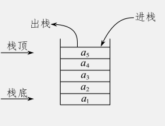
>
> n个不同元素进栈，出栈元素不同排列的个数为
> $$
> \frac{1}{n+1}C^n_{2n}
> $$
>
> $$
> C^m_n=\frac{n!}{m!{(n-m)!}}
> $$

#### 栈的基本操作

1. ==StackEmpty(S)==: 测试栈S是否为空
2. ==StackFull(S)==: 测试栈S是否已满
3. ==SatckTop(S)==: 返回栈S的栈顶元素
4. ==Push(x, S)==: 在栈S的栈顶插入元素x, 简称为将元素x入栈
5. ==Pop(S)==: 删除并返回栈S的栈顶元素,简称为出栈

#### 顺序栈的实现

> 采用顺序存储的栈称为顺序栈,它利用一组地址连续的存储单元存放自栈底到栈顶的数据元素,同时附设一个指针(top)指向当前栈顶元素的位置
>
> 栈的顺序存储类型可描述为
>
> ```c
> #define MaxSize 50	// 定义栈中元素的最大个数
> typedef struct {
>     ElemType data[MaxSize];  // 存放栈中元素
>     int top;				 // 栈顶指针
> }SqStack;
> ```
>
> ==栈顶指针==: S.top, 初始时设置S.top = -1
>
> ==栈顶元素==: S.data[S.top]
>
> ==进栈操作==: 栈不满时, 栈顶指针先加1,再送值到栈顶元素
>
> ==出栈操作==: 栈非空时, 先取栈顶元素值,再将栈顶指针减1
>
> ==栈空条件==: S.top == -1
>
> ==栈满条件==: S.top == MaxSize-1
>
> ==栈长==: S.top+1

#### 顺序栈的基本运算

```c
#define MaxSize 100
typedef char ElemType;
typedef struct
{
	ElemType elem[MaxSize]; // 栈元素的定义
	int top; /*栈指针*/
} SqStack;
void InitStack(SqStack *&s)
{
	s=(SqStack *)malloc(sizeof(SqStack));
	s->top=-1; // 最开始栈指针指向-1
}
int Push(SqStack *&s,ElemType e)
{
	if (s->top==MaxSize-1) return 0; // 判定是否栈满
	s->top++;s->elem[s->top]=e;
	return 1;
}
int Pop(SqStack *&s,ElemType &e)
{
	if (s->top==-1) return 0;   // 判定是否栈空
	e=s->elem[s->top];
	s->top--;
	return 1;
}
```

#### 共享栈

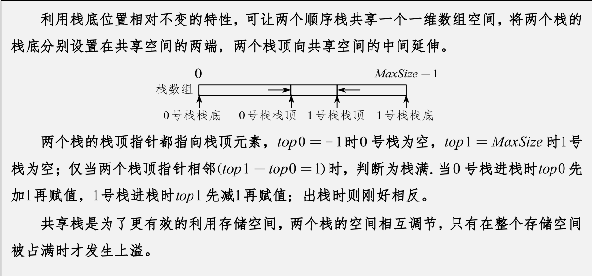

#### 链栈的概念

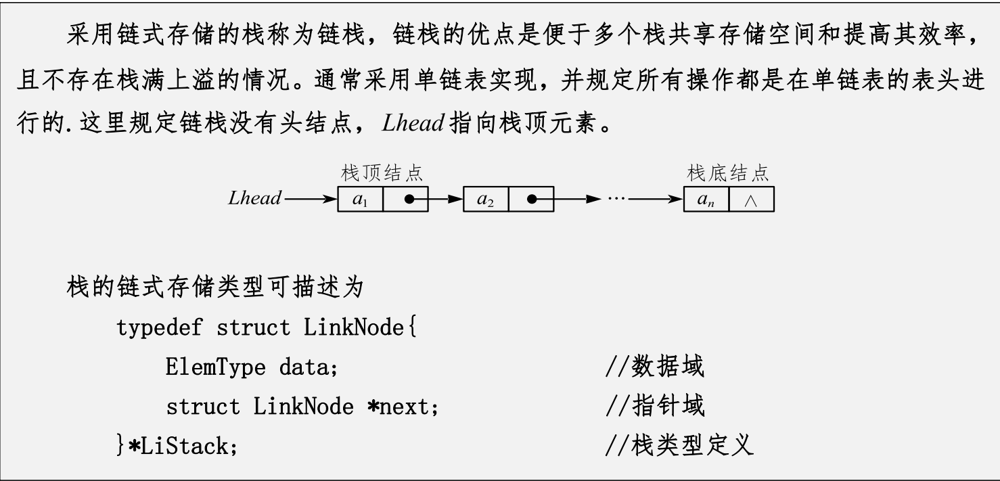

#### 链栈的基本运算

```c
typedef char ElemType;
typedef struct linknode
{
    ElemType data; /*数据域*/
    struct linknode *next; /*指针域*/
} LiStack;
void InitStack(LiStack *&s)
{
	s=(LiStack *)malloc(sizeof(LiStack));
	s->next=NULL;
}
void Push(LiStack *&s,ElemType e)
{
    LiStack *p;
    p=(LiStack *)malloc(sizeof(LiStack));
    p->data=e;
    p->next=s->next; /*插入*p 结点作为第一个数据结点*/
    s->next=p;
}int Pop(LiStack *&s,ElemType &e)
{
    LiStack *p;
    if (s->next==NULL) /*栈空的情况*/
    return 0;
    p=s->next; /*p 指向第一个数据结点*/
    e=p->data;
    s->next=p->next;
    free(p);
    return 1;
}
```

### 队列

#### 队列的基本概念

> ==队列==简称队。也是一种操作受限的线性表，只允许在表的一端进行插入，而在表的另一端进行删除。
>
> 向队列中插入元素称为入队或进队；删除元素称为出队或离队
>
> 队列操作的特定是==先进先出==
>
> ==队头==：允许删除的一端，又称队首
>
> ==队尾==：允许插入的一端
>
> 

#### 队列的基本操作

1. ==QueueEmpty(Q)==: 判断队列Q是否为空
2. ==QueueFull(Q)==: 判断队列Q是否已满
3. ==QueueFirst(Q)==: 返回队列Q的队首元素
4. ==QueueLast(Q)==: 返回队列Q的队尾元素
5. ==EnterQueue(x, Q)==: 再队列Q的队尾插入元素x
6. ==DeleteQueue(Q)==: 删除并返回队列Q的队首元素

#### 顺序队列的实现

> 队列的顺序实现是指分配一块连续的存储单元存放队列中的元素,并附设晾个指针; 队头指针front指向队头元素,队尾指针rear指向队尾元素的下一个位置
>
> 队列的顺序存储类型可描述为
>
> ```c
> #define MaxSize 50	// 定义队列中元素的最大个数
> typedef struct {
>     ElemType data[MaxSize];  // 存放队列元素
>     int top;				 // 队头指针和队尾指针
> }SqQueue;
> ```
>
> 初始状态(队空条件): Q.front == Q.rear == 0
>
> 进队操作: 队不满时, 先送值到队尾元素,再将队尾指针加1
>
> 出队操作: 队不空时, 先取队头元素值,再将队头指针加1
>
> 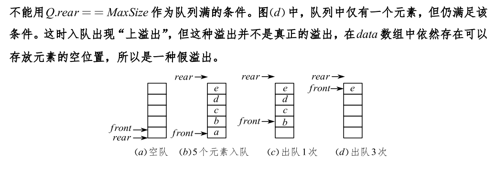
>
> 

#### 循环队列

> 将存储队列元素的表从逻辑上视为一个环，称为==循环队列==
>
> 当队首指针 Q.front = MaxSize-1 后在前进一个位置就自动到0，这可以利用除法取余运算( % ) 来实现
>
> ==初始时==: Q.front = Q,rear = 0
>
> ==队首指针进1==: Q.front = (Q.front + 1) % MaxSize
>
> ==队尾指针进1==: Q.rear = (Q.rear + 1) % MaxSize
>
> ==队列长度==: (Q.rear + MaxSize - Q.frant) % MaxSize
>
> ==出队入队时==: 指针都按顺时针方向进1
>
> ==最大容量==: MaxSize - 1 牺牲一个单元来区分队空和队满, 入队时少用一个队列单元
>
> ==队满条件==: (Q.rear + 1) % MaxSize == Q.frant
>
> ==队空条件==: Q.frant == Q.rear
>
> ==队列中元素的个数==: (Q.rear - Q.frant + MaxSize) % MaxSize 

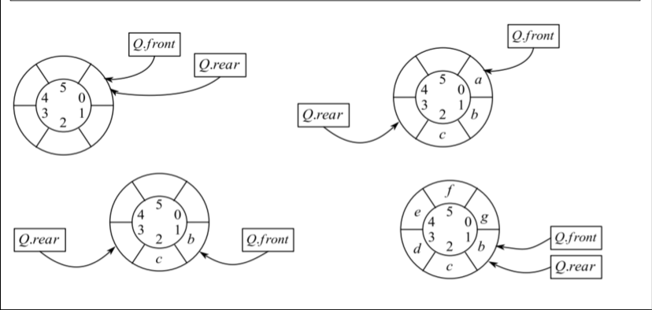

#### 顺序队的基本运算

```c
#define MaxSize 5
typedef char ElemType;
typedef struct
{
    ElemType elem[MaxSize];
    int front,rear; /*队首和队尾指针*/
} SqQueue;
void InitQueue(SqQueue *&q)
{
    q=(SqQueue *)malloc (sizeof(SqQueue));
    q->front=q->rear=0;
}
int QueueLength(SqQueue *q)
{
    return (q->rear-q->front+MaxSize)%MaxSize;
}
int enQueue(SqQueue *&q,ElemType e)
    {if ((q->rear+1)%MaxSize==q->front) return 0; /*队满*/
    q->rear=(q->rear+1)%MaxSize;
    q->elem[q->rear]=e;
    return 1;
}
int deQueue(SqQueue *&q,ElemType &e)
{
if (q->front==q->rear) /*队空*/ return 0;
q->front=(q->front+1)%MaxSize;
e=q->elem[q->front];
return 1;
}
```

#### 链式队列的实现

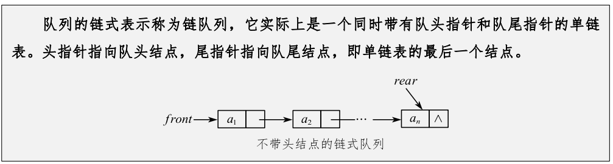

#### 链队的基本运算

`````c
typedef char ElemType;
typedef struct qnode
{
    ElemType data;
    struct qnode *next;
} QNode;
typedef struct
{
    QNode *front;
    QNode *rear;
} LiQueue;
	void enQueue(LiQueue *&q,ElemType e)	
{
    QNode *s;
    s=(QNode *)malloc(sizeof(QNode));
    s->data=e;
    s->next=NULL;if (q->rear==NULL) /*若链队为空,则新结点是队首结点又是队尾结点
    */
    q->front=q->rear=s;
    else
    {
    q->rear->next=s; /*将*s 结点链到队尾,rear 指向它*/
    q->rear=s;
    }
}
int deQueue(LiQueue *&q,ElemType &e)
{
    QNode *t;
    if (q->rear==NULL) /*队列为空*/
    return 0;
    if (q->front==q->rear) /*队列中只有一个结点时*/
    {
    t=q->front;
    q->front=q->rear=NULL;
    }
    else /*队列中有多个结点时*/
    {
    t=q->front;
    q->front=q->front->next;
    }
    e=t->data;
    free(t);
    return 1;
}
void InitQueue(LiQueue *&q)
    {q=(LiQueue *)malloc(sizeof(LiQueue));
    q->front=q->rear=NULL;
}
void ClearQueue(LiQueue *&q)
{
    QNode *p=q->front,*r;
    if (p!=NULL) /*释放数据结点占用空间*/
    {
    r=p->next;
    while (r!=NULL)
    {
    free(p);
    p=r;
    r=p->next;
    }
    }
    free(q); /*释放头结点占用空间*/
}
int QueueLength(LiQueue *q)
{
    int n=0;
    QNode *p=q->front;
    while (p!=NULL)
    {
    n++;
    p=p->next;
    }
    return(n);
}
`````

### 串

#### 串的基本概念

> 串是由零个或多个字符组成的有序序列
> $$
> S='a_2...a_n '
> $$
> 串的长度: 串中字符的个数 n 
>
> 空串: n=0
>
> 子串: 串中任意个连续的字符组成的子序列
>
> 字符在串中的位置: 该字符在串中的序号
>
> 子串在主串中的位置: 以子串的第一个字符在主串中的位置来表示
>
> 空格串: 由一个或多个空格组成的串
>
> 从数据结构来看,串是一种特殊的线性表,其特殊性体现在数据元素可以是一个字符

#### 串的基本操作

1. StrCopy(&T, S): 复制,将S赋给T
2. StrEmpty(S): 判断S是否为空
3. StrCompare(T, S): 比较T和S
4. StrLength(S): 求S长度
5. SubString(&Sub, S, pos, len): 求子串.将S的pos位置长度为len的子串赋给Sub并返回
6. Concat(&T, S1, S2): 将S1, S2连接起来赋给T并返回
7. Index(S, T): 定位操作.若主串S中存在与串T相同的子串,则返回它在主串S中第一次出现的位置; 否则返回0

### 习题

[课时4](./access/chapter4.png)

[课时5](./access/chapter5.png

## 四、树和二叉树

### 树

#### 树的基本概念

> 树是n(n≥0)个结点的有限集。当n=0时,称为空树。在任意一颗非空树上应满足
>  	1. 有且仅有一个特定的根的结点。
>  	2. 当n>1时,其余结点可分为m(m>0)个互不相交的有限集T~1~ T~2~ ... T~m~, 其中每个集合本身又是一棵树, 并且称为根的子树。
>
> 树作为一种逻辑结构,同时也是一种分层结构,具有以下两个特点:
>
> 1. 树的根结点没有前驱,除根结点外的所有结点有且只有一个前驱。
> 2. 树中所有结点可以有零个或多个后继。

##### 基本术语

> 1. ==祖先==: 根A到结点K的唯一路径上的任意结点, 称为结点K的祖先
>
>    ==双亲==: 路径上最接近结点K的结点E称为K的双亲
>
>    ==孩子==: K为结点E的孩子
>
> 2. ==结点的度==: 该结点的孩子个数（直接子代）, 结点E的度为2
>
>    ==树的度==: 树中结点的最大度数， 图中树的度为3
>
> 3. ==分支结点==（非终端结点）：度大于0 BCDEH
>
>    ==叶子结点==（终端结点）：度为0 FGIJKLM
>
>    ==兄弟==：有相同双亲的结点 KL
>
> 4. ==深度==: 从根结点开始自顶向下逐层累加
>
>    ==高度==: 从叶结点开始自底向上逐层累加
>
>    树的高度(或深度)是树中结点的最大层数
>
> 5. ==有序树==: 树中结点的各子树从左到右是有次序的,不能互换
>
>    ==无序树==
>
> 6. ==路径==: 树中两个结点之间的路径是由这两个结点之间所经过的结点序列构成的
>
>    ==路径长度==: 路径长度是路径上所经过的边的个数
>
>    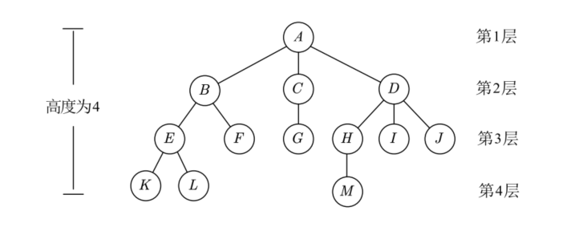

##### 树的性质

> 1. ==树中的结点数等于所有结点的度数加1==
>    $$
>    n = n_0*0+n_1*1+n_2*2+...n_m*m+1
>    $$
>    
>
> 2. ==度为m的树中第 i (i>=1)层上的结点至多有==
>    $$
>    m^{i-1}
>    $$
>
>
> 3. ==高度为h的m叉树上的结点至多有==
>    $$
>    (m^h - 1) / (m - 1)
>    $$
>
>
> 4. ==具有n个结点的m叉树的最小高度为== 
>    $$
>    log_m(n(m-1)+1)
>    $$
>
> 
>
> 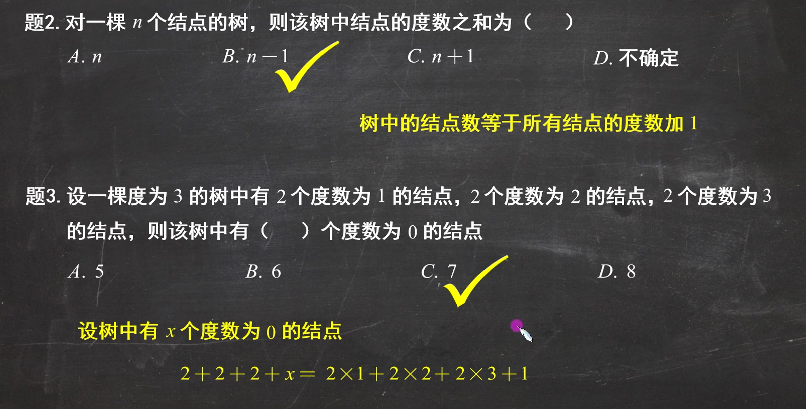
>
> 

### 二叉树

#### 二叉树的定义

> 二叉树的==特点==是每个结点至多只能有两棵子树（即二叉树中不存在度大于2的结点），并且二叉树的子树有左右之分，其次序不能任意颠倒。二叉树也以递归的形式定义。
>
> 二叉树是n（n>=0）个结点的有限集合：
>
> 1. 或者为空二叉树
> 2. 或者由一个根结点和两个互不相交的被称为根的左子树和右子树组成，左右子树又分别是一棵二叉树

#### 特殊的二叉树

> 1. ==满二叉树==
>
>    一棵高度为h，且含有==2^h^ - 1==个结点的二叉树称为满二叉树，即==树中每层都含有最多的结点==，如下图（a）所示。满二叉树的叶子结点都集中在二叉树的最下一层。并且除叶子结点之外的每个结点度数均为2
>
>    对满二叉树按层序编号：约定编号从根结点（根结点编号为1）起，自上而下，自左向右。这样，每个结点对应一个编号，对于编号为i的结点，若有双亲，则其双亲为==[i/2]==，若有左孩子，则左孩子为 ==2i==；若有右孩子，则右孩子为 ==2i+1==
>
> 2. ==完全二叉树==
>
>    高度为h、有n个结点的二叉树，当且仅当其每个结点都与高度为h的满叉树中编号为 1~n 的结点一一对应时，称为完全二叉树，
>
>    即在满二叉树最下一层最右边开始连续删去若干结点
>
>    如图（b）所示。其特点如下：
>
>    * 若 i<=[n/2]，则结点i为分支结点，i>[n/2]为叶子结点
>    * 叶子结点只可能在层次最大的两层上出现。对于最大层次中的叶子结点，都依次排列在该层最左边的位置上
>    * 若有度为1的结点，则可能只有一个，且该结点只有左孩子而无右孩子
>    * 按层序编号后，一旦出现某结点（编号为i）为叶子结点或只有左孩子，则编号大于i的结点均为叶子结点
>    * 若n为奇数，则每个分支都有左孩子和右孩子；若n为偶数，则编号最大的分支结点（编号为n/2）只有左孩子，没有右孩子，其余分支结点左、右孩子都有。
>
>    ==性质：==
>
>    * 深度为k的完全二叉树至少要有==2^k-1^==，最多为==2^k^-1==
>    * ==n~1~=1====n~1~+n~2~=[n/2]==
>    * 具有n个结点的完全二叉树的深度为==[log~2~n]+1==向下取整或==[log~2~(n+1)]==向上取整     
>
> 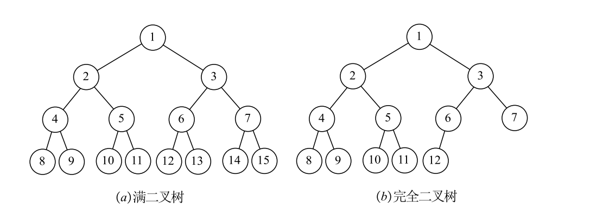
>
> 3. ==二叉排序树==
>
>    左子树上所有结点的关键字均小于根结点的关键字；右子树上的所有结点的关键字均大于根结点的关键字；左子树和右子树又各是一颗二叉排序树
>
> 4. ==平衡二叉树==
>
>    树上任一结点的左子树和右子树的深度之差绝对值不超过1

#### 二叉树的性质

> 1. 非空二叉树的叶子结点数等于度为2的结点数加1，即==n~0~ = n~2~ + 1==
> 2. 非空二叉树上第k层上至多有==2^k-1^==个结点（k>=1）至少有==k==
> 3. 高度为h的二叉树至多有==2^h^ - 1==个结点（h>=1）
> 4. 对完全二叉树按从上到下，从左到右的顺序依次编号1，2，...，n，则有一下关系：
>    * 当==i>1==时，结点i的双亲的编号为==[i/2]==，则当i为偶数时，其双亲的编号为==i/2== ，它是双亲的左孩子；当i为奇数时，其双亲的编号为==(i-1)/2==，它是双亲的右孩子
>    * 当==2i<=n==时，结点i的左孩子编号为==2i==，否则无左孩子
>    * 当==2i+1<=n==时，结点i的右孩子编号为==2i+1==，否则无右孩子
> 5. 具有==n(n>0)==个结点的完全二叉树的高度为==[log~2~(n+1)]==或==[log~2~(n)]+1==

#### 二叉树的存储结构

1. ==顺序存储结构==

   > 指用一组地址连续的存储单元依次自上而下、自左而右存储完全二叉树的结点元素，即将完全二叉树上编号为i的结点元素存储在一维数组下标i-1的分量中
   >
   >  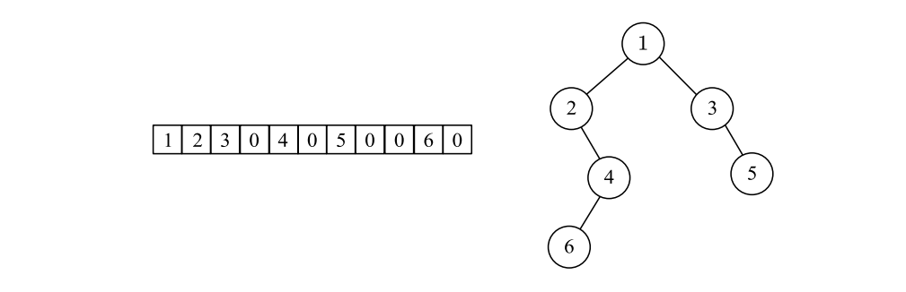

2. ==链式存储结构==

   > 用链表结点来存储二叉树中的每个结点。在二叉树中，结点结构通常包括若干数据域和若干指针域，二叉链表至少包括3个域：==数据域data==，
   >
   > ==左指针域lchild==，==右指针域rchild==
   >
   >  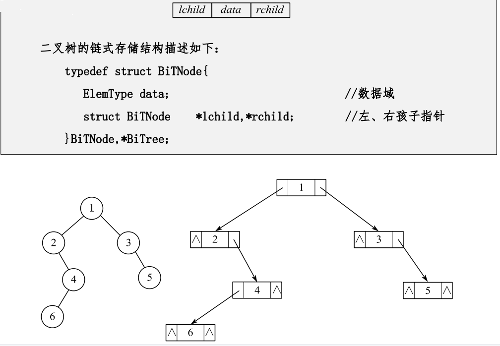
   >
   > <u>在含有n个结点的二叉链表中，含有==n+1==个空链域，==n-1==个非空链域</u>


#### 二叉树的遍历

> 二叉树的遍历是指按某条搜索路径访问树中每个结点，使得每个结点均被访问一次，而且仅被访问一次
>
> 由二叉树的递归定义可知，遍历一颗二叉树便要决定对根结点N，左子树L，右子树R的访问顺序。按照先遍历左子树再遍历右子树的原则，常见的遍历次序有先序（NLR）、中序（LNR）和后序（LRN）三种遍历算法，其中“序”指的是根结点在何时被访问。
>
> 1. ==先序遍历==
>
>    先序遍历（PreOrder）的操作过程如下：
>
>    若二叉树为空，则什么都不做；否则
>
>    * 访问根结点
>    * 先序遍历左子树
>    * 先序遍历右子树
>
>    对应的递归算法如下：
>
>    ```c
>    void PreOrder(BiTree T) {
>        if (T != NULL) {
>            visit(T);	// 访问根结点
>            PreOrder(T->lchild);	// 递归遍历左子树
>            PreOrder(T->rchild);	// 递归遍历右子树
>        }
>    }
>    ```
>
> 2. ==中序遍历==
>
>    中序遍历（InOrder）的操作过程如下；
>
>    若二叉树为空，则什么都不做；否则
>
>    * 中序遍历左子树
>    * 访问根结点
>    * 中序遍历右子树
>
>    对应的递归算法如下：
>
>    ~~~c
>    void InOrder(BiTree T) {
>        if（T != NULL) {
>    		InOrder(T->lchild);		// 递归遍历左子树
>            visit(T); 		// 访问根结点
>            InOrder(T->rchild);		// 递归遍历右子树
>        }
>    }
>    ~~~
>
>    
>
> 3. ==后序遍历==
>
>    后序遍历（PostOrder）的操作如下
>
>    若二叉树为空，则什么都不做；否则
>
>    * 后序遍历左子树
>    * 后序遍历右子树
>    * 访问根节点
>
>    对应的递归算法如下：
>
>    ~~~c
>    void PostOrder(BiTree T) {
>        if (T != NULL) {
>            PostOrder(T->lchild);	// 递归遍历左子树
>            PostOrder(T->rchild);	// 递归遍历右子树
>            visit(T);	// 访问根结点
>        }
>    }
>    ~~~
>
>    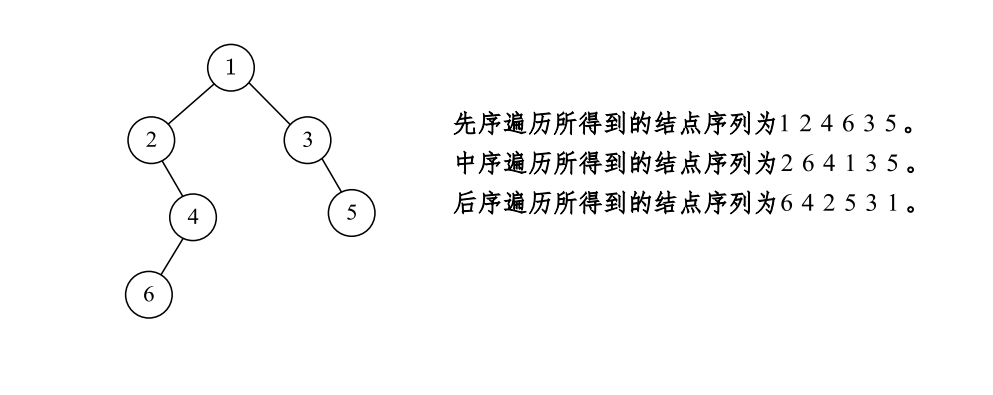
>
> 4. 层次遍历
>
>    要进行层次遍历，需要借助一个队列。先将二叉树根结点入队，然后出队，访问出队结点，若它有左子树，则将左子树根结点入队；若它有右子树，则将右子树根结点入队。然后出队，访问出队结点...如此反复，直至队列为空
>
>    二叉树的层次遍历算法如下：
>
>    ```c
>    void LevelOrder(BiTree T) {
>        InitQueue(Q);	// 初始化辅助队列
>        BiTNode *p=T;	
>        EnQueue(Q,p);	// 将根结点入队
>        while (!IsEmply(Q)) {	// 队列不空则循环
>            DeQueue(Q,p);		// 队头元素出队
>            visit(p);			// 访问出队结点
>            if(p->lchild != NULL)
>                EnQueue(Q, p->lchild);	// 左子树不为空，左子树根结点入队
>            if(p->rchild != NULL)
>                EnQueue(Q, p->rchild)l	// 右子树不为空，右子树根结点入队
>        }
>    }
>    ```

### 习题1

[课时6](./access/chapter6.png)

### 树和森林

#### 树的存储结构

> * 双亲链表表示法
>
>   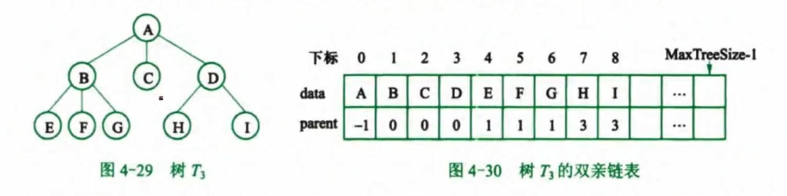
>
> * 孩子链表表示法
>
>   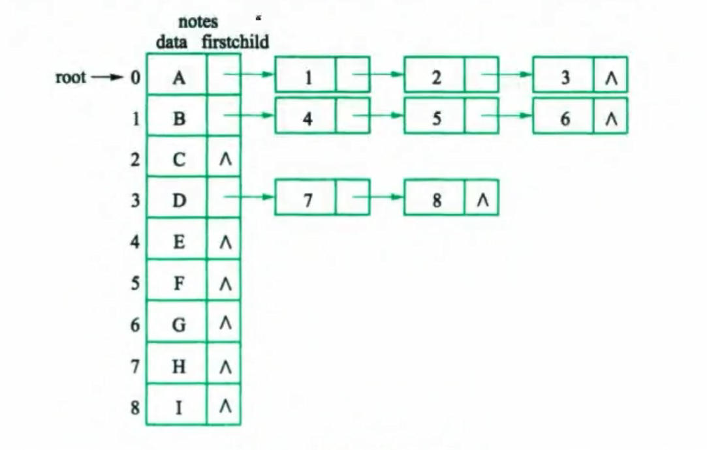
>
> * 孩子兄弟表示法
>
>   也就是转换成二叉树

#### 树转换成二叉树的画法

> * 在兄弟结点之间加一条线
>
> * 对每个结点，只保留它与第一个孩子的连线，抹去与其他孩子的连线
>
> * 以树根为轴心，顺时针旋转45°(右兄弟变右孩子，无兄弟变左孩子)
>
>   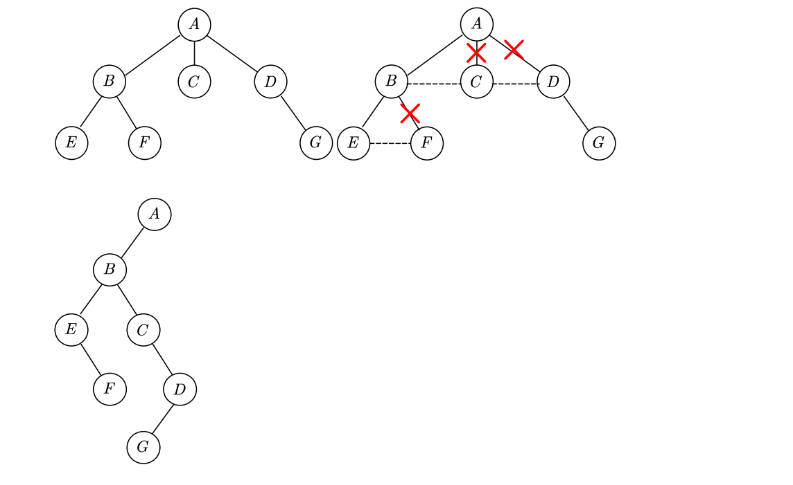
>   
>   ==由于树根没有兄弟，故树转换为二叉树后，二叉树的根结点的右子树必为空==

#### 森林转换成二叉树的画法

> * 将森林中的每棵树转换成相应的二叉树
> * 每棵树的根也可视为兄弟结点，在每棵树之间加一根连线
> * 以第一颗树的根为轴心顺时针旋转45°
>
> 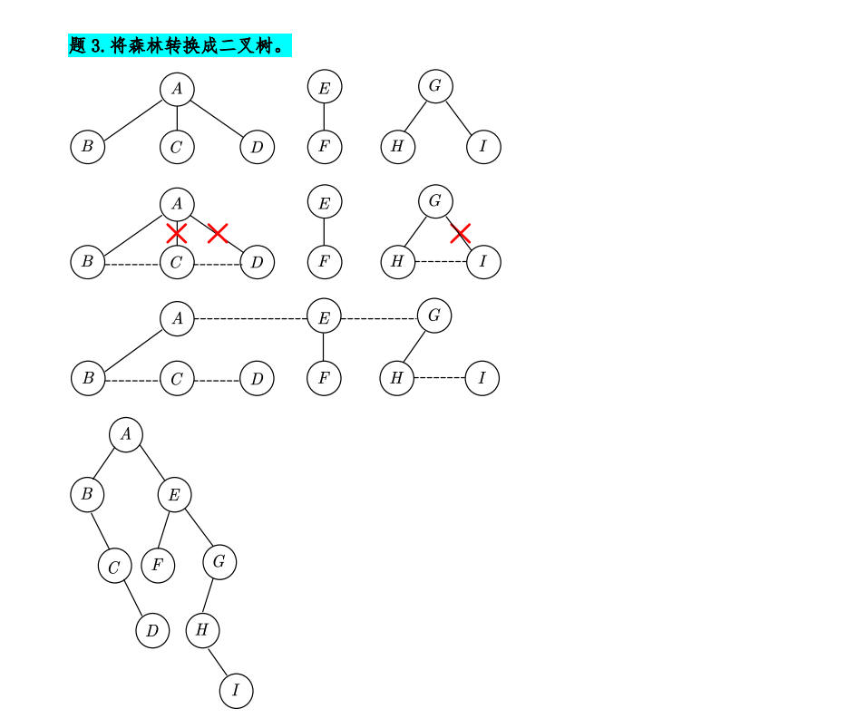
>
> 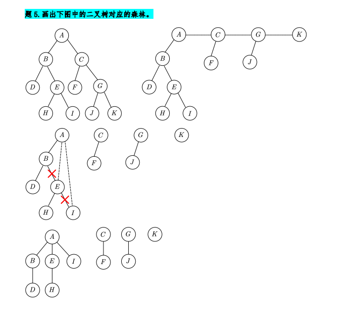

#### 树的遍历

> 树的遍历是指用某种方式访问树中的每个结点，且仅访问一次。主要有两种方式
>
> 1. 先根遍历
>
>    若树非空，先访问根结点，再依次遍历根结点的每颗子树，遍历子树时仍遵循先根后子树的规则。其遍历次序与这棵树对应二叉树的先序序列相同
>
> 2. 后根遍历
>
>    若树非空，先依次遍历根结点的每颗子树，再访问根结点，遍历子树时仍遵循先子树后根的规则。其遍历次序与这棵树对应二叉树的中序序列相同
>
>    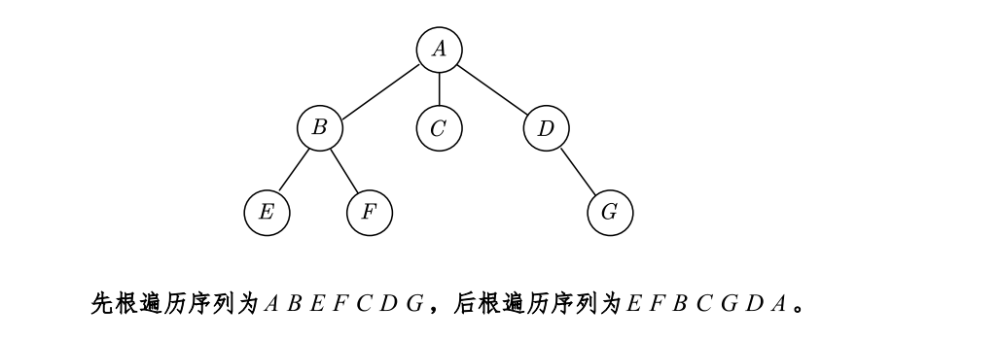

#### 森林的遍历

> 1. 先序遍历
>
>    若森林非空，先访问森林中第一颗子树的根结点，再先序遍历第一颗树中根结点的子树森林，再先序遍历除去第一颗树之后剩余的树构成的森林
>
> 2. 中序遍历
>
>    若森林非空，先中序遍历第一颗树中根结点的子树森林，再访问森林中第一颗子树的根结点，再中序遍历除去第一颗树之后剩余的树构成的森林
>
>    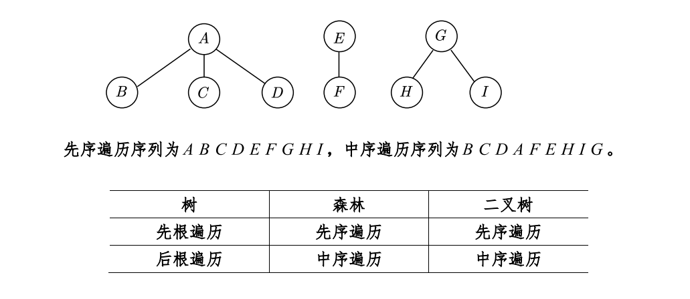

### 二叉排序树

#### 二叉排序树的定义

> 二叉排序树（二叉查找树）或者是一颗空树，或者是具有以下特性的二叉树
>
> 1. 若左子树非空，则左子树上所有结点的值均小于根结点的值
> 2. 若右子树非空，则右子树上所有结点的值均大于根结点的值
> 3. 左、右子树也分别是一颗二叉排序树
>
> 根据二叉排序树的定义，左子树结点值<根节点值<右子树结点值，所以二叉排序树进行中序遍历，可以得到一个递增的有序序列
>
> 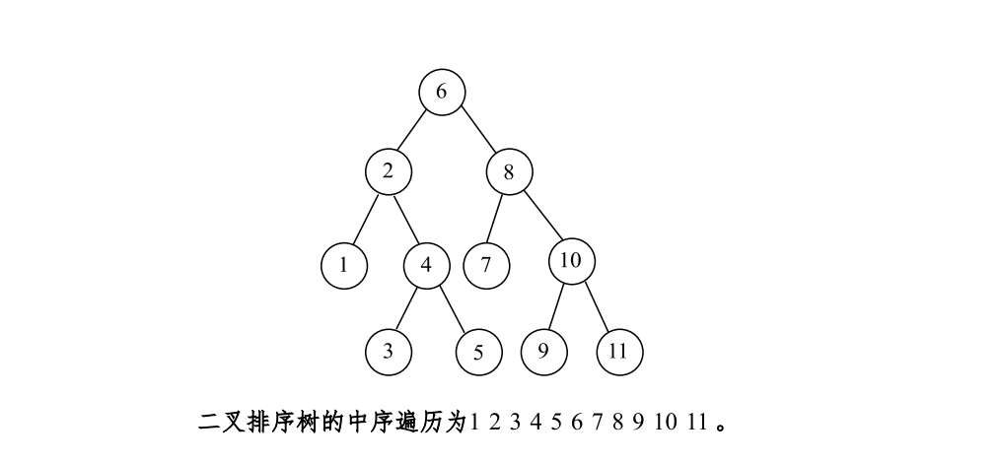

#### 二叉树的插入

> 若原二叉排序树为空，则直接插入结点；否则，若关键字k小于根结点值，则插入到左子树，若关键字k大于根结点值，则插入到右子树
>
> 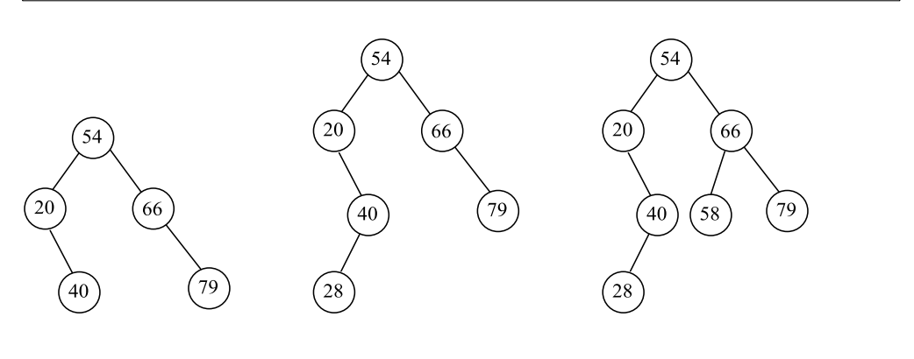

#### 二叉排序树的删除

> 1. 若被删除得结点是叶子结点，则直接删除；
>
> 2. 若结点只有一颗左子树或者右子树，则让该结点得子树成为其父结点得子树
>
> 3. 若结点有左、右两颗子树，则令该结点得直接后继（直接前驱）代替该结点，然后从二叉排序树中删去这个直接后继（直接前驱)，这样就转换成了前两种情况
>
>    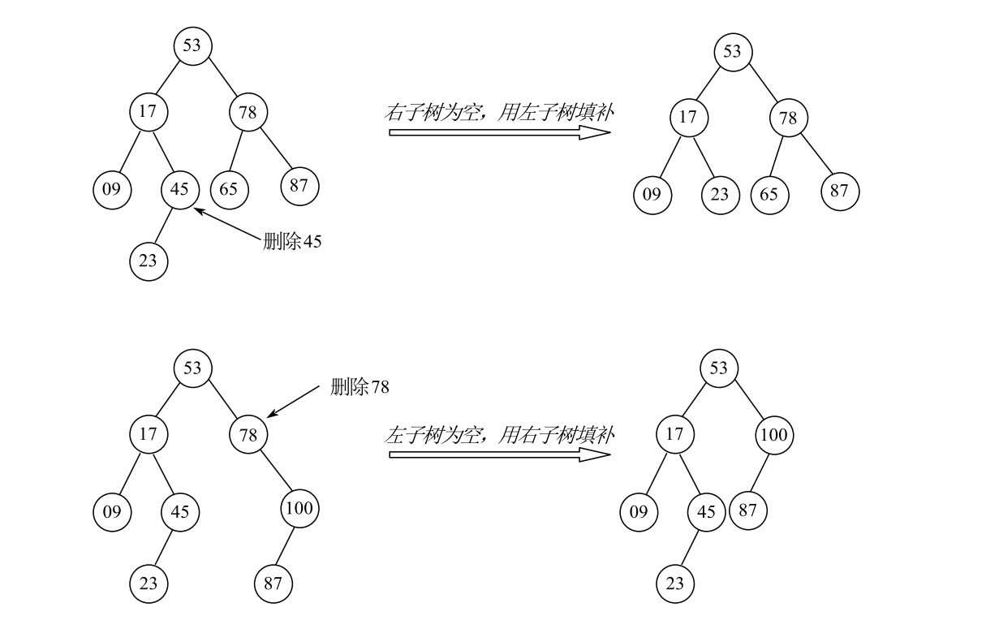
>
>    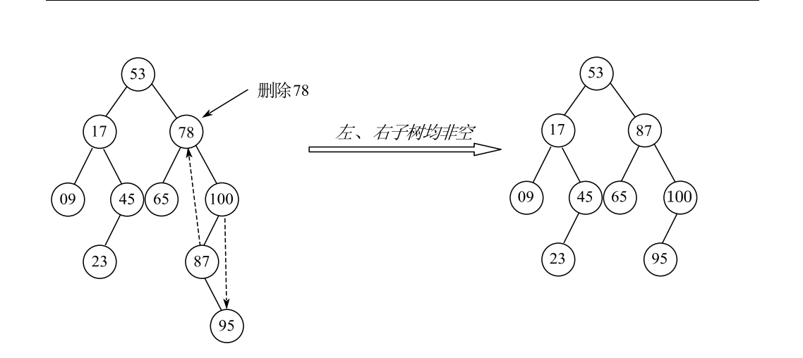

### 哈夫曼树

> 树中结点常被赋予一个代表某种意义得数值，那个数值称为该结点得权
>
> 从树得根到任意结点得路径长度（经过得边数）与该结点上权值得乘积，称为该结点得带权路劲长度
>
> 树中所有叶子结点得带权路径长度之和称为该树得带权路径长度，记为
> $$
> WPL=\sum^{n}_{i=1}w_il_i
> $$
> 带权路径长度最小得二叉树称为哈曼夫树，也称为最优二叉树
>
> 给定n个权值分别为W1, W2, ..., Wn 的结点，构造哈夫曼树的算法描述如下
>
> 1. 将这n个结点分别作为n棵仅含一个结点的二叉树，构成森林F
> 2. 构造一个新结点，从F中选取两颗根结点权值最小的树作为新结点的左、右子树，并且将新结点的权值置为左、右子树上根结点的权值之和
> 3. 从F中删除刚才选出的两棵树，同时将新得到的树加入F中
> 4. 重复步骤（2）和（3），直至F中只剩一棵树为止

### 习题2

[课时7](./access/chapter7.png)

## 五、图

### 图的基本结构

> 1. ==有向图==
>
>    若E是有向边（弧）的有限集合时，则图G为有向图。弧时顶点的有序对。记为<V, W>，其中v, W是顶点，V称为弧尾，W称为弧头，<V, W>称为从顶点V到顶点W的弧
>
> 2. ==无向图==
>
>    若E是无向边（边）的有限集合时，则图G为无向图。边是顶点的无序对。记为(V, W)或(W, V)，因为两者相等，其中V, W是顶点，顶点V，W互为邻接点。边(V, W)依附于顶点V, W，或者边(V, W)和顶点V，W相关联
>
> 3. ==简单图==
>
>    一个图G若满足（1）不存在重复边；（2）不存在顶点到自身的边；则称图G为简单图
>
> 4. ==多重图==
>
>    若图G中某两个结点之间的边数多于一条，又允许顶点通过一条边和自己关联，则图为多重图
>
> 5. ==完全图（简单完全图）==
>
>    对于无向图，任意两个顶点之间都存在边。
>    $$
>    n*(n-1)/2
>    $$
>    
>
>    对于有向图，任意两个顶点之间都存在相反的两条弧
>    $$
>    n*(n-1)
>    $$
>    
>
> 6. ==子图==
>
>    设有两个图G=(V, E)和G'=(V', E')，若V'是V的子集，且E'是E的子集，则称G'是G的子图。
>
>    若有满足V(G')=V(G)的子图G'，则称其为G的生成子图
>
> 7. ==连通、连通图==
>
>    在无向图中，若从顶点V到顶点W有路径存在，则称V和W是连通的
>
>    若图G中任意两个顶点都是连通的，则称图G是连通图
>
>    极小连通子图是既要保持图连通又要使得边数最少的子图
>
> 8. ==生成树==
>
>    连通图的生成树是包含图中全部顶点的一个极小连通子图
>
> 9. ==顶点的度、入度和出度==
>
>    对于无向图，顶点V是依附于该顶点的边的条数。无向图的全部顶点的度的和等于边数的两倍
>
>    对于有向图，入度是以顶点V为终点的有向边的数目。出度是以顶点V为起点的有向边的数目。顶点的度等于入度和出度之和。有向图的全部顶点的入度之和与出度之和相等，并且等于边数。
>
> 10. ==边的权和网==
>
>     在一个图中，每条边都可以标上具有某种意义的数值，该数值从称为该边的权值。这种边上带有权值的图称为带权图，也称网。
>
> 11. ==路径、路径长度和回路==
>
>     顶点V~p~到顶点V~q~之间的一条路径是指顶点序列V~p~, V~i1~, V~i2~, ..., V~im~, V~q~
>
>     路径上边的数目称为路径长度。第一个顶点和最后一个顶点相同的路径称为回路或环

### 图的存储结构

> 1. ==邻接矩阵法==
>
>    邻接矩阵存储，是指用一个一维数组存储图中顶点的信息，用一个二维数组存储图中边的信息（即各顶点之间的邻接关系），存储顶点之间邻接关系的二维数组称为邻接矩阵
>
>    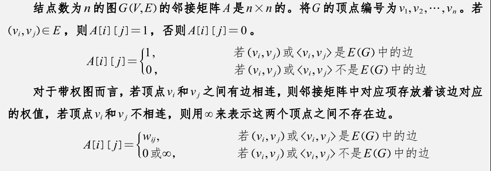
>
>    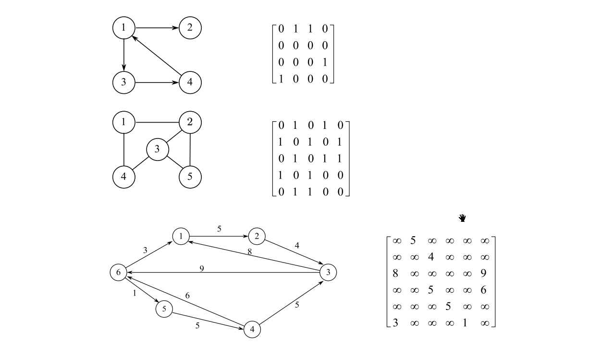
>
>    ==图的邻接矩阵存储表示法具有以下特点:==
>    (1) 无向图的邻接矩阵一定是个对称矩阵。
>    (2) 对于无向图,邻接矩阵的第行(或第i列)非零元素(或非∞元素)的个数正好是第i个顶点的度。
>    (3) 对于有向图,邻接矩阵的第行(或第i列)非零元素(或非∞元素)的个数正好是第i个顶点的出度(或入度)。
>
> 2. ==邻接表法==
>
>    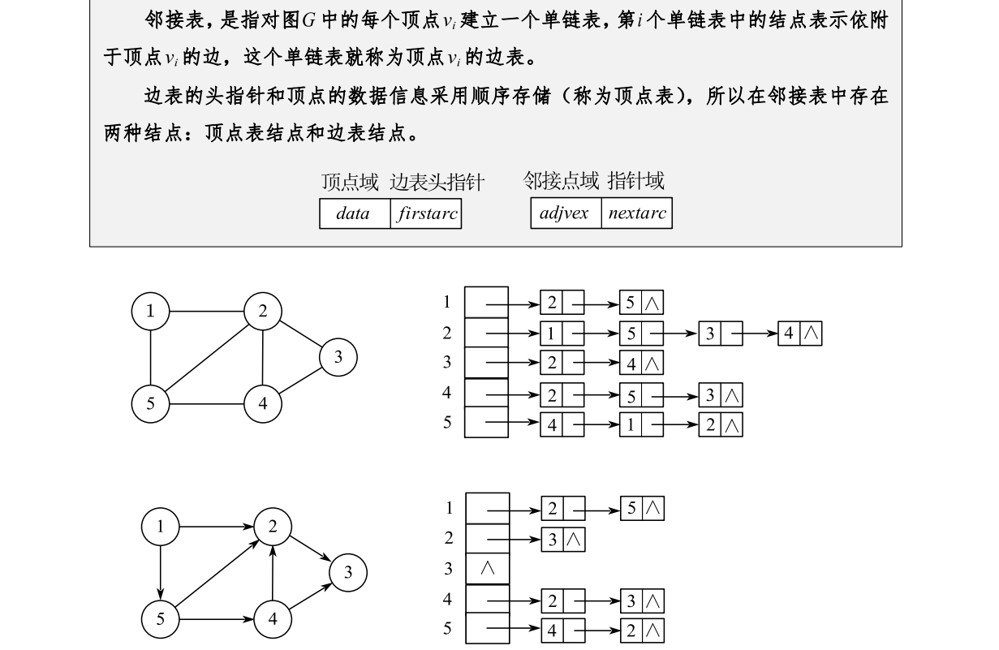
>
>    ==图的邻接表存储表示法具有以下特点:==
>    (1) 若G为无向图,则所需的存储空间为O(|V|+|2E|);若G为有向图,则所需的存储空间为O(|V|+|E|)
>    (2) 对于稀疏图,采用邻接表表示能极大地节省存储空间。
>    (3) 图的邻接表表示不唯一。
>    (4) 在有向图的邻接表表示中,求一个给定顶点的出度只需计算其邻接表中的结点个数。
>
> 3. ==十字链表法==
>
> 4. ==邻接多重表法==

### 图的遍历

> 图的遍历是指从图中的某一顶点出发,按照某种搜索方法沿着图中的边对图中的所有顶点访问一次且仅访问一次。
>
> 1. 广度优先搜索
>    广度优先搜索类似于二叉树的层序遍历算法。其基本思想是:首先访问起始顶点,接着由v出发,依次访问v的各个未访问过的邻接顶点w1,w2,…,wi;,然后依次访问w1,w2,…,wi的所有未被访问过的邻接顶点;再从这些访问过的顶点出发,访问它们所有未被访问过的邻接顶点,直至图中的所有顶点都被访问过为止。若此时图中尚有顶点未被访问,则另选图中的一个未被访问的顶点作为始点,重复上述过程,直至图中所有顶点都被访问到为止。
>
> 2. 深度优先搜索
>
>    广度优先搜索类似于树的先序遍历。其基本思想是:首先访问起始顶点ν,然后由v出发,访问与v邻接且未被访问的任一顶点W,再访问与W邻接且未被访问的任一顶点。重复上述操作。当不能再继续向下访问时,依次退回到最近被访问的顶点,若它还有邻接顶点未被访问过,则从该点开始继续上述搜索过程,直至图中所有顶点均被访问过为止。

### 最小生成树

> 对一个带权连通无向图,所有生成树中权值之和最小的生成树称为最小生成树。
>
> 最小生成树具有如下性质
>
> (1)最小生成树不一定是唯一的,即最小生成树的树形不唯一。
>
>    当带权连通无向图中的各边权值互不相等时,这时最小生成树才是唯一的。
>
> (2)最小生成树的边的权值之和总是唯一的。
>
> (3)最小生成树的边数为顶点数减1
>
> 1. Prim算法
>
>    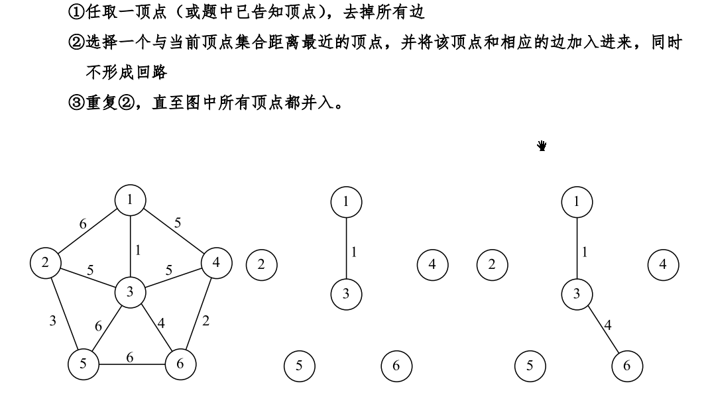
>
>    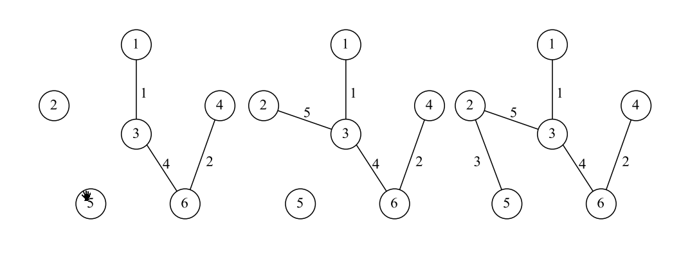
>
> 2. Kruskal算法
>
>    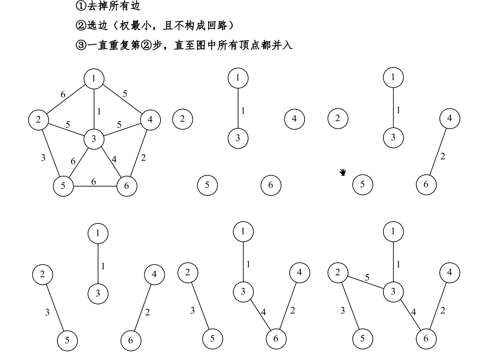
>
> 3. 最短路径
>
>    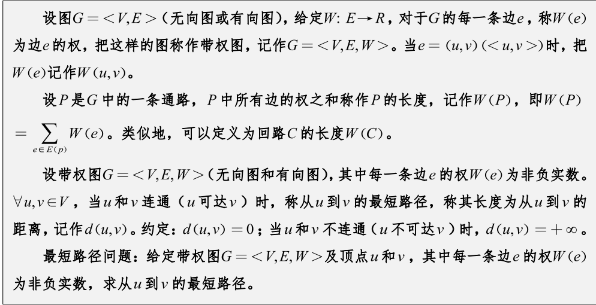
>
>    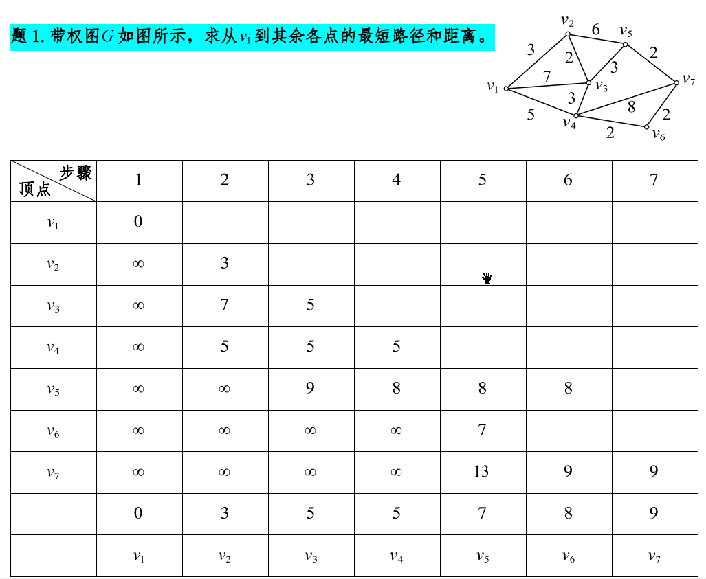
>
>    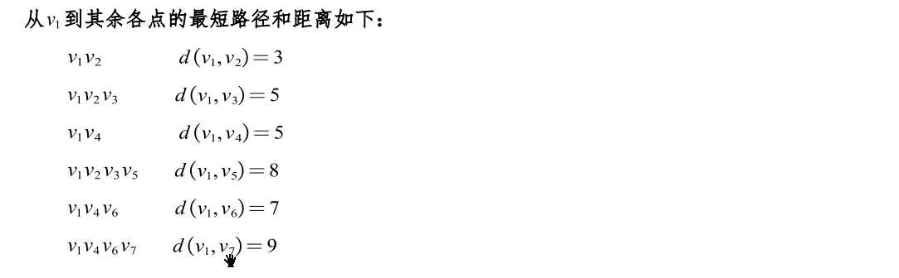

### 拓扑排序

> 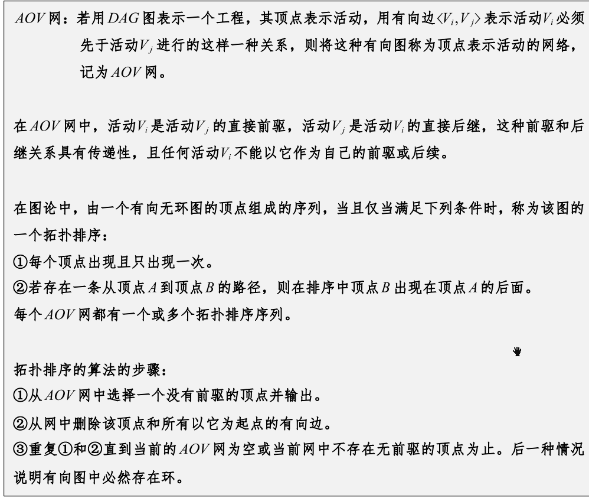

### 关键路径

> 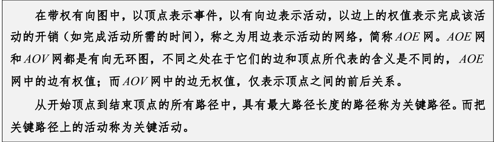
>
> 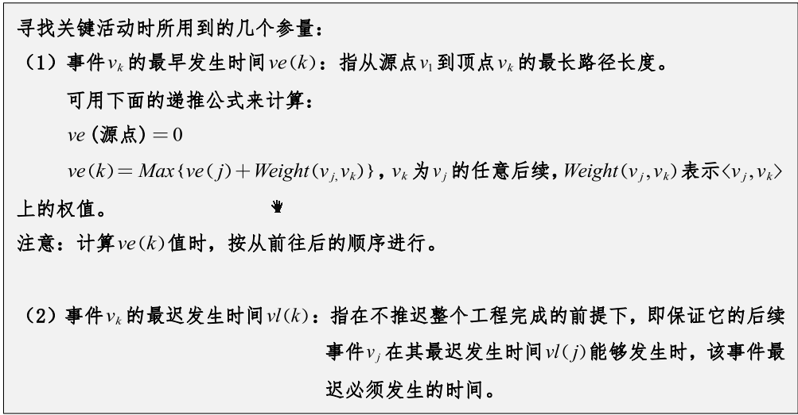
>
> 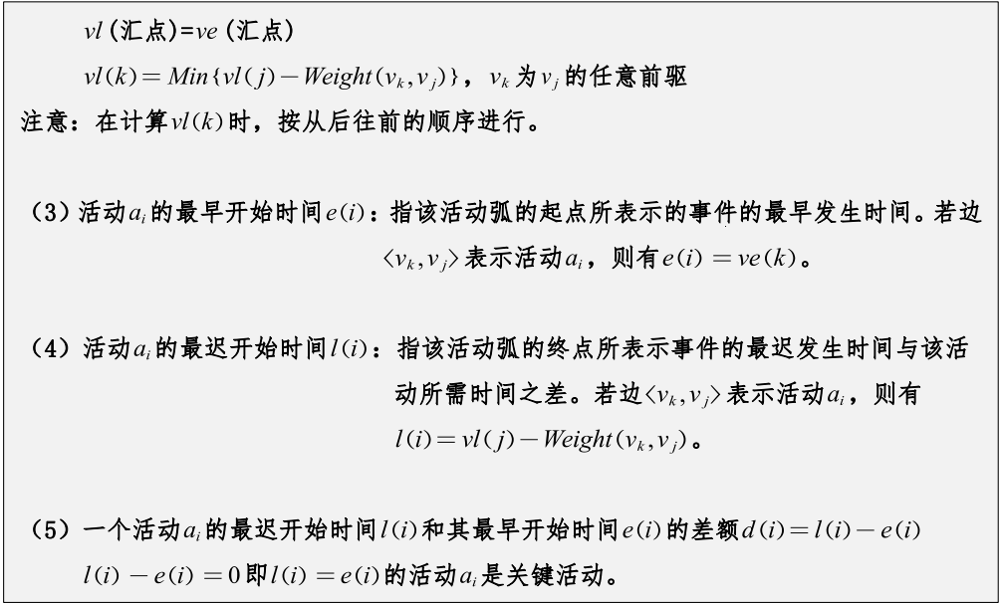
>
> 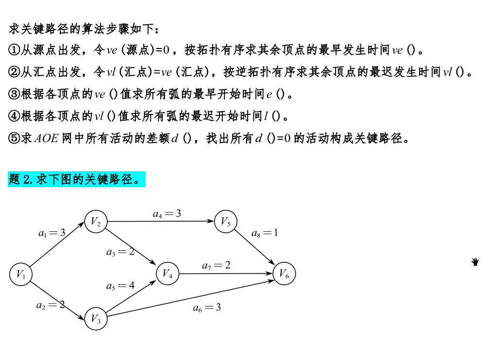
>
> 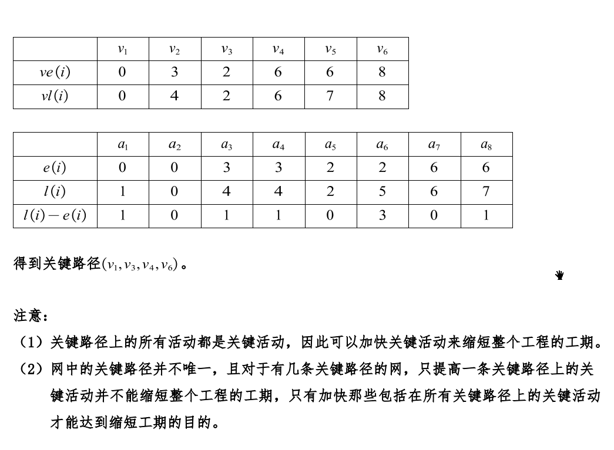
