# 关系数据库与SQL语言

## 目录

[toc]


## 一、数据库系统概述

### 数据库系统中的基本概念

> ==Data==：（数据）它是描述客观事物的一种符号记录。
>
> ==DB==：（数据库）它是长期存储在计算机内的有组织、可共享的数据的集合。
>
> ==DBMS==：（数据库管理系统）它是管理数据库的一种应用软件。
>
> ==DBA==：（数据库管理员）它是数据库的管理员。
>
> ==DBS==：（数据库系统）时采用数据库技术的一种系统，它包含上述四个
>
> ==数据库系统==包括：DB、DBMS、DBA、应用系统
>
> 数据库用户: 终端用户, 数据库管理员, 应用程序员

### 数据库技术的产生、发展

|    阶段    |  时间   |                             特点                             |
| :--------: | :-----: | :----------------------------------------------------------: |
|  人工管理  | 20C 50S |       不共享、不独立、数据不保存、使用应用程序管理数据       |
|  文件系统  | 20C 60S | 共享性、独立性差、数据可以长期保存、由文件系统管理数据、数据冗余大 |
| 数据库系统 | 20C 70S | 数据结构化、共享性高、冗余性低、独立性高、有统一的数据管理和控制功能 |


> ==数据的独立性==是数据库系统的最基本的特征之一。 数据独立性是指数据与程序独立存放, 不同的数据被存放在不同的文件中, 不同的数据只能被对应的应用程序所使用
>
> ==数据一致性==就是当多个用户试图同时访问一个数据库，它们的事务同时使用相同的数据，可能会发生以下四种情况：丢失更新、未确定的相关性、不一致的分析和幻想读。

### 数据库管理系统（DBMS）

#### DBMS的主要功能

> 1. ==数据定义功能 & DDL==
>
>    用于改变数据库结构，包括创建、更改和删除数据库对象
>
> 2. ==数据操纵功能 & DML==
>
>    数据库的基本操作：检索、更新、增删改查等
>
> 3. ==数据控制功能 & DCL==
>
>    用来授予和撤销用户权限

### 数据库系统的三级模式

> 内模式：模式  1：1，它要保证数据的物理独立性
>
> 模式：外模式  1：N，它要保证数据的逻辑独立性。
>
> * ==外模式==
>
>   也称==用户模式==或==子模式==
>
>   数据库用户能看到并允许使用的那部分局部数据的逻辑结构和特征的描述（视图和部分基本表）
>
> * ==模式==
>
>   也称==概念模式==
>
>   数据库中全体数据的逻辑结构和特征的描述（基本表）
>
> * ==内模式==
>
>   也称==存储模式==
>
>   它是对数据库存储结构的描述；是数据在数据库内部的表示方式(存储文件)

### 数据模型

> 数据模型是数据库的框架
>
> 数据模型是数据库系统的核心和基础
>
> 是描述数据与数据之间的联系、数据的语义、数据一致性约束的概念性工具的集合。

#### 分类

> 1. ==概念数据模型（信息模型）==
>
>    面向用户的，按照用户的观点进行建模
>
>    典型代表：E-R图
>
> 2. ==结构数据模型==
>
>    面向计算机系统的，用于DBMS的实现
>
>    典型代表：层次模型，网状模型、关系模型、面向对象模型

#### 数据模型的三要素

> 1. ==数据结构==
>
>    创建数据库
>
> 2. ==数据操作==
>
>    创建基本表
>
> 3. ==数据约束==
>
>    数据的完整性约束即检查约束

#### E-R图

> E-R实体联系图是直观表示概念模型的工具，其中包含了实体、联系、属性三个成分，联系的方法为一对一（1:1）、一对多（1:N）、多对多（M:N）三种方式，联系属于哪种方式取决于客观实际本身。
>
> E-R模型图，既表示实体，也表示实体之间的联系，是现实世界的抽象，与计算机系统没有关系，是可以被用户理解的数据描述方式。通过E-R模型图可以使用户了解系统设计者对现实世界的抽象是 否符合实际情况，从某种程度上说E-R模型图也是用户与系统设计者进行交流的工具，E-R模型图已 成为概念模型设计的一个重要设计方法。
> ==实体用矩形框表示，联系用菱形表示，属性用椭圆表示==

#### 层次模型

> 1. 层次模型采取树形结构表示数据与数据之间的关系
> 2. 层次模型不能直接表示多对多的联系

#### 网状模型

> 1. 用网络结构表示数据与数据之间的联系的模型
> 2. 网状模型子节点和父节点联系不唯一，需要为联系命名
> 3. 网状模型的优点是能更直观的描述世界，良好的性能，缺点是结构复杂

#### 关系模型

> 1. 关系模型是目前最常见的数据模型之一，主要采用表格结构表达实体集以及实体之间的联系，最大的特色就是描述的一致性。
> 2. 关系是一张表，关系数据模型由若干个表组成。
> 3. 可以存在1对1，1对多，多对多的关系

### 数据库对象

> 1. 表 table (行-元组-记录；列-字段-属性)
> 2. 字段 field
> 3. 索引 index
> 4. 视图 view（虚拟表）
> 5. 存储数据 （函数）

### 小结

> * 掌握数据库、数据库系统、数据库管理系统的基本概念、英文缩写及其之间的关系;
> * 了解数据管理技术发展的三个阶段及数据库系统阶段的特点;
> * 掌握数据库系统三级模式结构;
> * 了解数据模型的分类，
> * 以及掌握关系模型中关系、属性（字段）、元组（记录）域的概念。
> * 掌握实体、属性、联系的概念以及实体间的联系类型(1:1；1:m ; m:n)

## 二、关系模型

### 关系的含义及其性质

> 根据表达查询的方法不同, 关系运算可分为关系代数和关系演算两大类, 关系代数中, 运算的对象和结果均为关系(表 )
>
> 关系是一种规范化了的二维表中行的集合
>
> * 每一列中的分量必须来自同一个域,必须是同一类型的数据。
> * 不同的属性可来自同一个域,==不同的属性必须有不同的名字==
> * ==列的顺序可以任意交换==。
> * ==关系中元组的顺序(即行序)可任意==
> * ==关系中不允许出现相同的元组。==
> * ==关系中每一分量必须是不可分的数据项。==

### 关系的码

> * ==候选码(Candidate Key)==
>   学生关系 中的学号能唯一标识每一个学生
>   选课关系 中, 只有属性的组合“学号+课程号”才能唯一地区分每一条选课记录
>   能唯一标识关系中元组的一个属性或属性集,称为候选码(candidate Key)(唯一性、最小性)
>
> * ==主码(Primary Key)==
>
>   被数据库设计者选中的,用来在同一实体集中区分不同
>
>   实体的候选码称为主码。
>
>   每个关系必须选择一个主码，且不能随意改变
>
> * ==外码==
>
>   一个关系的一个属性是另一个关系中的主码则这个属性为外码

### 关系的完整性

==完整性约束==

* ==实体完整性==: 保证数据表中的每条记录都唯一
* ==参照完整性==: 保证相关联表之间的数据保持一致，保证相关联表之间具有相同的属性名和数据行
* ==域完整性==: 保证数据的有效性，保证数据列的数据类型一致
* ==用户自定义完整性==: 反映某一具体应用所涉及的数据必须满足的语义要求，一般情况下采用check来设置

### 关系代数

> * ==相容性==
>
>   设给定两个关系R、S，若满足以下条件则相容
>
>   1. 具有相同的列数（或称度数）n；
>   2. R中第i个属性和S中第i个属性必须来自同一个域
>
>   除笛卡尔积外，其他集合的运算要求参加运算的关系必须满足上述的相容性定义
>
> * ==并运算==
>
> * ==交运算==
>
> * ==差运算==
>
> * ==选择==
>
>   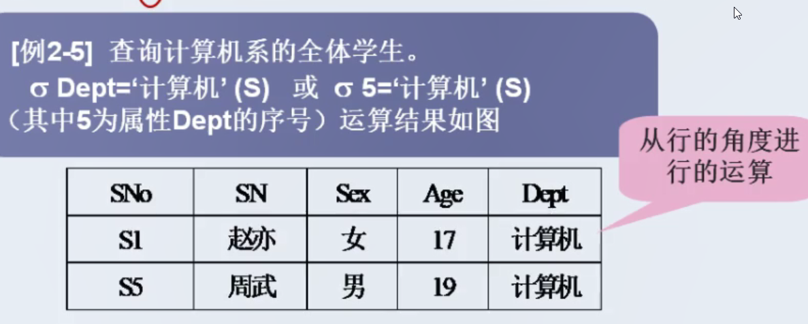 
>
> * ==投影==
>
>   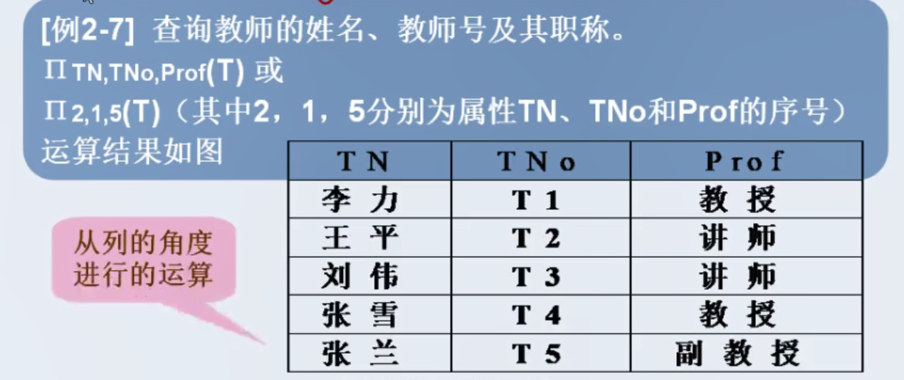
>
>   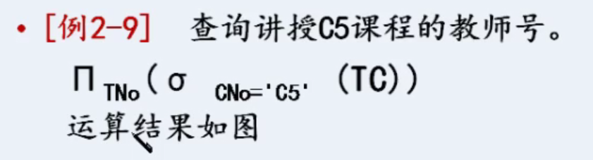
>
> * ==连接==
>
>   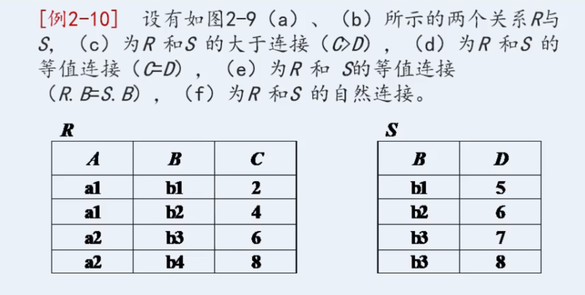
>
>   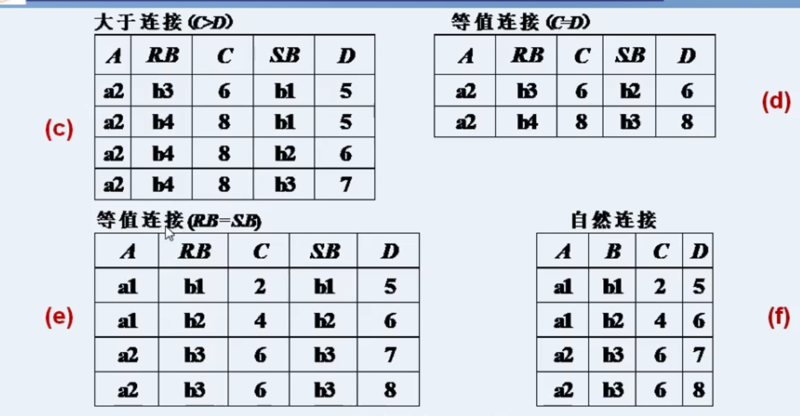
>
> * ==除法==

### 小结

> * 了解关系的含义、了解关系的性质；
> * 掌握候选键、主键、外键、主属性、非主属性的定义及其选取;
> * 掌握数据完整性并能区分3种不同的完整性；
> * 掌握并、交、差、笛卡尔积、投影、选择、连接。


## 三、关系数据库标准语言（SQL）

> ==结构化查询语言 (Structured Query Language)==
>
> 

### 数据定义--数据库

#### 数据库标识符

> 字母、数字、下划线、@、#

#### 九大命令动词

> ==Create==：创建
>
> ==Alter==：修改
>
> ==Drop==：删除
>
> ==Insert==：插入
>
> ==Update==：更新
>
> ==Delete==：删除
>
> ==Select==：查询
>
> ==Grant==：授予
>
> ==revoke==：收回

#### T-SQL语言的主要功能

> 1. 数据定义：DDL：Create、Alter、Drop、Select
>
> 2. 数据操作：DML：Insert、Update、Delete
>
> 3. 数据控制：DCL：Grant、Revoke

#### 数据库的结构

1. ==主数据文件==：有且只有一个（.mdf）
2. ==次数据文件==：包含0、1、n个（.ndf）
3. ==日志文件==：至少有一个（.ldf）

#### 系统数据库

1. ==Master==：存放系统级信息
2. ==Tempdb==：存放临时数据
3. ==Model==：存放模板数据
4. ==Msdb==：安排SQL server的周期活动，包括任务调度、异常处理和报警管理等

#### 数据库的创建

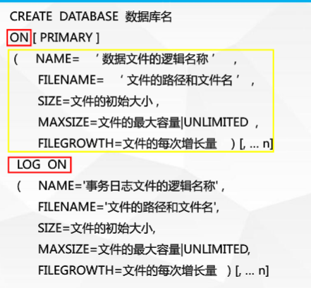


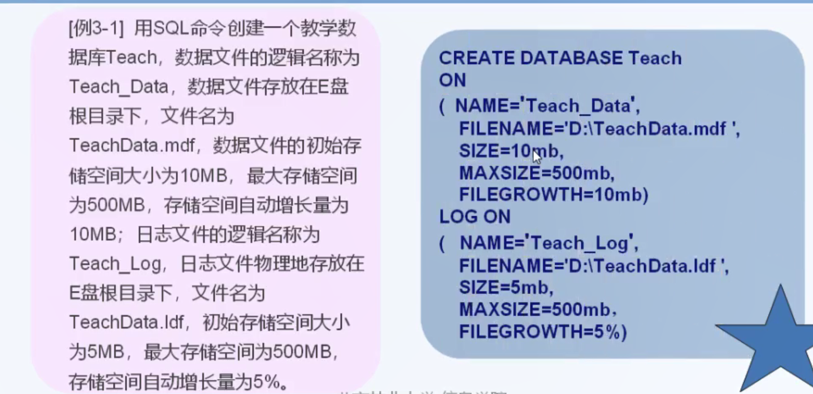

#### 数据库的删除

> DDL
>
> Drop database 数据库名

### 数据定义--数据表

#### 数据类型

==常用的五个==

1. int 整型
2. float、decimal(p,s)
3. money
4. char（n）定长\varchar（n）不定长
5. datetime 日期时间型

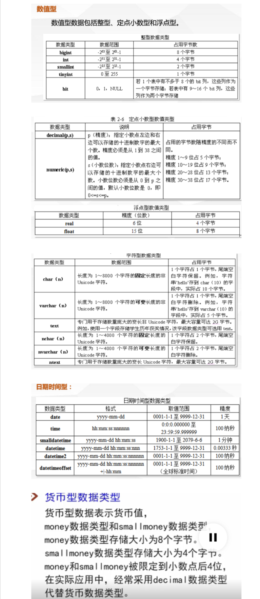


#### 约束类型

> 【CONSTRAINT <约束名>】约束类型
>
> * ==主键约束==：primary key
>
>   * 设置主键：
>
>     (a) 列名 类型 主键约束
>
>     (b) CONSTRAINT 主键约束名（Pk_表名）Primary Key(主键名)
>
>     (c) 在修改表时，设置主键
>
>     ```sql
>     alter table 表名
>     add constraint PK_表名
>     primary key(列名)
>     ```
>
>   * 删除主键：
>
>     ```sql
>     alter table 表名
>     drop constraint PK_表名
>     ```
>
> * ==外键约束==：foreign key
>
> * ==检查约束==：check
>
> * ==唯一约束==：unique
>
> * ==默认值约束==：default
> *  ==空值约束==：null/not null

#### 基本表的创建

> ```sql
> create table 表名
> (列名 数据类型 约束条件,
> 列名...........,
> ......)
> ```
>
> 

#### 表结构的修改

> 1. ==修改表名==
>
>    ```sql
>    Execute sp_rename  旧表名,新表名;
>    ```
>
> 2. ==修改列名==
>
>    ```sql
>    Execute sp_rename '表名.旧列名','新列名'[.column];
>    ```
>
> 3. ==修改列==
>
>    ```sql
>    Alter table 表名
>    Alter coulmn 列名 数据类型
>    ```
>
> 4. ==添加列==
>
>    ```sql
>    Alter table 表名
>    add 列名 数据类型
>    ```
>
> 5. ==删除列==
>
>    ```sql
>    Alter table 表名
>    Drop coulmn 列名  
>    ```

### 数据查询

#### 单表查询

> * ==格式==
>
>   ```sql
>   Select 字段名列表 from 表名 where 条件 group by 分组条件 order by 排序条件 
>   ```
>
> * ==简单查询==
>
>   <u>产品表(编号, 名称, 价格, 库存量, 厂家)</u>
>
>   1. 查询指定字段
>
>      <u>查找产品表中所有产品的名称和价格</u>
>
>      ```sql
>      Select 名称, 价格 from 产品表
>      ```
>
>   2. *
>
>      <u>查找产品表中所有信息</u>
>
>      ```sql
>      Select * from 产品表
>      ```
>
>   3. distinct(去重)
>
>      <u>查找产品表中有几个厂家</u>
>
>      ```sql
>      Select distinct 厂家 from 产品表
>      ```
>
>   4. top n(查找前n条记录)
>
>      <u>查找产品表前3条记录</u>
>
>      ```sql
>      Select top 3 * from 产品表
>      ```
>
>   5. 聚合函数
>
>      * max
>
>        <u>查找最高售价</u>
>
>        ```sql
>        Select max(价格) from 产品表
>        ```
>
>      * min
>
>        <u>查找最低售价</u>
>
>        ```sql
>        Select min(价格) from 产品表
>        ```
>
>      * sum
>
>        <u>求总价格</u>
>
>        ```sql
>        Select sum(价格) from 产品表
>        ```
>
>      * avg
>
>        <u>求平均价格</u>
>
>        ```sql
>        Select avg(价格) from 产品表
>        ```
>
>      * count
>
>        <u>求有几个产品</u>
>
>        ```sql
>        Select count(*) from 产品表
>        ```
>
>      * as
>
>        <u>取别名</u>
>
>        ```sql
>        Select count(*) as 产品数量 from 产品表
>        Select count(*) 产品数量 from 产品表
>        ```
>
> * ==where条件查询==
>
>   1. 单条件
>
>      <u>查询价格大于2000的产品信息</u>
>
>      ```sql
>      Select * from 产品表 where 价格 > 2000;
>      ```
>
>   2. 多条件 and or
>
>      <u>查询价格大于2000且小于3000的产品信息</u>
>
>      ```sql
>      Select * from 产品表 where 价格 > 2000 and 价格 < 3000;
>      ```
>
>      <u>查询价格小于2000且大于3000的产品信息</u>
>
>      ```sql
>      Select * from 产品表 where 价格 < 2000 or 价格 > 3000;
>      ```
>
>   3. between ... and
>
>      <u>查询价格在2000到3000的产品信息</u>
>
>      ```sql
>      Select * from 产品表 where 价格 between 2000 and 3000;
>      ```
>
>   4. in
>
>      <u>查询价格在等于2000或3000的产品信息</u>
>
>      ```sql
>      Select * from 产品表 where 价格 in(2000, 3000);
>      ```
>
>   5. like % _
>
>      <u>查找名称中含有"电"的产品信息</u>
>
>      ```sql
>      Select * from 产品表 where 名称 like '%电%';
>      ```
>
>      <u>查找名称两个字以"电"开头的产品信息</u>
>
>      ```sql
>      Select * from 产品表 where 名称 like '电_';
>      ```
>
> * ==group by==
>
>   <u>查找各个厂家产品的价格平均值</u>
>
>   ```sql
>   Select avg(价格) from 产品表 group by 厂家;
>   ```
>
>   <u>查找平均价格大于1000的厂家均价和厂家名称</u>
>
>   ```sql
>   Select avg(价格) 厂家均价, 名称 from 产品表 group by 厂家 having avg(价格) > 1000;
>   ```
>
> * ==order by==
>
>   <u>查找所有产品信息按价格升序排列</u>
>
>   ```sql
>   Select * from 产品表 order by 价格 asc
>   ```
>
>   <u>查找所有产品信息按价格降序排列</u>
>
>   ```sql
>   Select * from 产品表 order by 价格 desc
>   ```
>
>   

#### 多表查询

> 学生表(学号, 姓名, 性别, 专业, 院系)
>
> 成绩表(学号, 课程名称,  成绩)
>
> * ==简单连接==
>
>   <u>查询数学课程有成绩的学生的学号, 姓名</u>
>
>   ```sql
>   select 学生表.学号, 姓名  from 学生表, 成绩表
>   where 学生表.学号 = 成绩表.学号
>   and 成绩表.课程名称 = '数学'
>   ```
>
> * ==内连接==
>
>   内连接(相等连接)又叫等值连接，在连接条件这使用等号（=）运算符比较被连接列的列值，其查询结果中列出被连接表中的所有列，包括其中的重复列.
>
>   <u>查询数学课程有成绩的学生的学号, 姓名</u>
>
>   ```sql
>   select 学生表.学号, 姓名  
>   from 学生表.学号 inner join 成绩表.学号
>   on 学生表.学号 = 成绩表.学号
>   and 成绩表.课程名称 = '数学'
>       
>   select 学生表.学号, 姓名  
>   from 学生表.学号 inner join 成绩表.学号
>   on 学生表.学号 = 成绩表.学号
>   where 成绩表.课程名称 = '数学'
>   ```
>
>   
>
> * ==左连接==
>
>   <u>查询数学课程有成绩的学生的学号, 姓名</u>
>
>   ```sql
>   select 学生表.学号, 姓名  
>   from 学生表.学号 left join 成绩表.学号
>   on 学生表.学号 = 成绩表.学号
>   and 成绩表.课程名称 = '数学'
>   /*
>   此时 on and 和 on where 是有区别的
>   on where 会过滤掉左表不符合条件的
>   on and 则会保留重复
>   */
>   select 学生表.学号, 姓名  
>   from 学生表.学号 left join 成绩表.学号
>   on 学生表.学号 = 成绩表.学号
>   where 成绩表.课程名称 = '数学'
>   ```
>
> * ==右连接==
>
>   ```sql
>   select 学生表.学号, 姓名  
>   from 学生表.学号 right join 成绩表.学号
>   on 学生表.学号 = 成绩表.学号
>   and 成绩表.课程名称 = '数学'
>   ```

#### 子查询

> 学生表(学号, 姓名, 性别, 专业, 年龄, 院系)
>
> 彩排表(日期, 院系)
>
> * ==普通子查询==
>
>   <u>查询与胡小二同专业学生的信息</u>
>
>   ```sql
>   select * from 学生表 
>   where 专业 = (
>   	select 专业 from 学生表
>       where 姓名 = "胡小二"
>   )
>   ```
>
> * ==any== 
>
>   <u>查询其他系中比计算机系某一学生年龄高的姓名, 年龄</u>
>
>   ```sql
>   select 姓名, 年龄
>   from 学生表
>   where 年龄 > (
>       select min(年龄) from 学生表 
>       where 院系 = '计算机系' )
>   and 院系 != '计算机'
>   
>   select 姓名, 年龄
>   from 学生表
>   where 年龄 > 
>   	ANY(select 年龄 from 学生表 
>           where 院系='计算机')
>   and  院系 <> '计算机'
>   ```
>
> * ==all==
>
>   <u>查询其他系中比计算机系所有学生年龄高的姓名, 年龄</u>
>
>   ```sql
>   select 姓名, 年龄
>   from 学生表
>   where 年龄 > (
>       select max(年龄) from 学生表 
>       where 院系 = '计算机系' )
>   and 院系 != '计算机'
>   
>   select 姓名, 年龄
>   from 学生表
>   where 年龄 > 
>   	ALL(select 年龄 from 学生表 
>           where 院系='计算机')
>   and  院系 <> '计算机'
>   ```
>
> * ==in==
>
>   <u>查询在周日彩排的院系的男同学的姓名</u>
>
>   ```sql
>   select 姓名 from 学生表
>   where 性别 = '男'
>   and 院系 in (
>   	select 院系 from 彩排表 
>       where 日期 = '周日'
>   )
>   ```
>
>   

### 数据操纵

#### 增

> 1. 为表中所有列添加数据
>
>    - 指定所有字段名
>
>      ```sql
>       Insert into 表名(列名1,列名2,...)
>       values(值1,值2,....);
>      ```
>
>    - 不指定字段名
>
>      ```sql
>       Insert into 表名 values(值1,值2,....);
>      ```
>
> 2. 向表中指定列表添加数据
>
>      ```sql
>       Insert into 表名(字段1,字段2,...)
>       values(值1,值2,....);
>      ```
>
> 3. 向表中同时添加多条数据
>
>      ```sql
>       Insert into 表名[(字段1,字段2,...)]
>       values(值1,值2,....),(值1,值2,....),(值1,值2,....),;
>      ```

#### 删

> ```sql
>  Delete from表名 【where 条件表达式】
>  --如若无where，则删除表中所有记录
>  Truncate【table】表名
>  --删除表中所有记录
> ```

#### 改

> ```sql
>  Update 表名
>  set字段名1=值1【，字段名2=值2，...】
>  【where 条件表达式】--指定所需满足的条件
> ```

### 视图

> 视图是一个虚拟表, 是从基本表或其本身导出的，不占实际内存
>
> 对视图的数据操作和数据查询与表操作一致
>
> 优点: 利于数据保密, 简化查询操作, 保证数据的逻辑独立性
>
> * ==创建视图==
>
>   ```sql
>   create view 视图名 as
>   select ...
>   ```
>
> * ==修改视图==
>
>   ```sql
>   alter view 视图名 as
>   select ...
>   ```
>
> * ==删除视图==
>
>   ```sql
>   drop view 视图名
>   Delete view 数据行
>   ```

### 索引

> 索引类似于书的目录，通过索引可以达到快速查询数据行的功能
>
> 索引是对数据库表中的一个或多个列的值进行排序的结构，索引是依赖于表建立的，它提供了数据库中编排表中数据的内部方法
>
> * ==优点==
>   1. 索引能提高查询表内数据的速度
>   2. 能加快表与表之间的连接速度
>
> * ==缺点==
>   1. 创建和维护索引增加了额外的时间成本
>   2. 索引会占用一定的储存空间，占用空间过大时会数据库的性能
>
> * ==聚集索引==
>
>   索引逻辑顺序与记录物理顺序相同，由于表中的记录只能按一种物理顺序存储，所以一个表只有一个聚集索引。
>
>   简单来说就是聚集索引和数据的存放顺序是一致的，聚集索引叶节点就是数据
>
>   ```sql
>   --唯一的聚集索引
>   CREATE UNIQUE CLUSTERED INDEX [IX_TableName_Name] ON [dbo].[TableName] ([FieldName] ASC)
>   
>   --不唯一的聚集索引
>   CREATE CLUSTERED INDEX [IX_TableName_Name] ON [dbo].[TableName] ([FieldName] ASC)
>   ```
>
> * ==非聚集索引==
>   是在不改变记录的物理顺序的基础上，通过顺序存放指向记录的指针来实现建立逻辑顺序的方法。索引逻辑顺序与记录物理顺序不同不受
>   物理顺序的影响，一个表的非聚集索引最多可以有249个。
>
>   非聚集索引的叶节点是定位器。
>
>   ```sql
>   CREATE INDEX IX_TableName_FieldName ON DataTable(FieldName DESC)
>   ```
>
> * ==唯一索引==
>
>   唯一索引能够保证索引键中不包含重复的值，从而使表中的每一行从某种方式上具有唯一性。 只有当唯一性是数据本身的特征时，指定唯一索引才有意义。
>
>   保证索引键中不包含重复的值（包含NULL值）
>
>   ```sql
>   CREATE UNIQUE INDEX IX_TableName_FieldName ON DataTable(FieldName ASC)
>   ```
>
> * ==创建索引的基本原则==
>   1. 定义有主键或外键的数据列一定要建立索引。
>   2. 对于经常查询的数据列最好建立索引
>   3. 对于需要在指定范围内快速或频繁查询的数据列最好建立索引
>   4. 经常使用在where子句中的数据列最好建立索引


## 四、关系数据库理论

### 数据依赖与规范化

> 数据不规范容易出现的问题
>
> * ==数据冗余==：想修改一个属性，就要更新多行数据
> * ==插入异常==：想要插入数据,结构因为表设计的问题，导致不能成功插入
> * ==更新异常==：只想删除其中的某些数据 ，结果把不该删的也删了
> * ==删除异常==：想更新一条数据,结果工作量大，还容易出错

### 关系依赖

> * ==函数依赖==
>
>   x -> y, x决定y, y依赖于x
>
>   * 例：学号 -> 姓名	# 学号决定姓名, 姓名依赖于学号
>
> * ==平凡函数依赖==
>
>   x -> y, 但x包含y (y包含于x)
>
>   * 例: (学号, 课号) -> 课号	# 课号存在于(学号, 课号)之中
>
> * ==非平凡函数依赖==
>
>   x -> y, 但x不包含y 
>
>   * 例: (学号, 课号) -> 成绩	# 成绩不存在于(学号, 课号)之中
>
> * ==完全函数依赖==
>
>   x -> y, 对于X的任意一个真子集X'都有X'不能函数决定Y
>
>   * 例: (学号, 课号) -> 成绩	# 只有学号或姓名无法决定成绩，二者缺一不可
>
> * ==部分函数依赖==
>
>   x -> y, 存在X的某一个真子集X'能够函数决定Y
>
>   * 例: (学号, 课号) -> 姓名	# 只有学号就能决定姓名，课号为冗余项
>
> * ==传递函数依赖==
>
>   x -> y,x不包含y，y不决定x，y—>z，即x对x传递函数依赖
>
>   * 例: 学号 -> 系号, 系号 -> 系主任, 学号 -> 系主任	# 系号 不可以决定学号
>
> * ==直接函数依赖==
>
>   x -> y, y -> x，y —> z, x -> z
>
>   * 例:(在姓名不重复的情况下) 学号 -> 姓名, 姓名 -> 学号, 姓名 -> 课程, 学号 -> 课程	# 学号<->姓名

### 求候选码

> * ==L类==：所有依赖关系中仅出现在函数依赖左部的属性。
>
> * ==R类==：所有依赖关系中仅出现在函数依赖右部的属性。
>
> * ==LR类==：所有依赖关系中即出现在函数依赖左部又出现在函数依赖右部的属性。
>
> * ==N类==：所有依赖关系中没有出现的属性。
>
> 1. 先尝试==唯一候选码==的情况
>    * 若X（X⊆R）是L类属性，且X+包含了R的全部属性，则X必为R的唯一候选码
>    * 若X（X⊆R）是R的N类和L类属性组成的属性集，且X+包含了R的全部属性，则X是R的唯一候选码
>
> 2. 直接列出所有可能性
>
> * ==例题==
>
>   (a) <u>设有关系模式R（A,B,C,D）与它的函数依赖集F={D -> B, B -> D, AD -> B, AC -> D}, 求R的所有候选码</u>
>
>   ​	L类: A, C
>
>   ​	X(A, C) = (A,C,D,B)
>
>   ​	则X(A,C)为R的唯一候选码
>
>   (b) <u>设有关系模式R（A,B,C,D,E,P）与它的函数依赖集F={A -> D, E -> D, D -> B, BC -> D, DC -> A}, 求R的所有候选码</u>
>
>   ​	L类: C, E
>
>   ​	X(C, E) = (C,E,D,B,A) 缺少P
>
>   ​	则X(C, E, P)为R的唯一候选码
>
>   (c) <u>设有关系模式R（A,B,C,D,E）与它的函数依赖集F={A -> BC, CD -> E, B -> D, E -> A}, 求R的所有候选码</u>
>
>   ​	L类: 无
>
>   ​	x(A)=(A,B,C,D,E); x(B)=(B,D); x(C)=(C); x(D)=(D); x(E)=(E,A,B,C,D);
>
>   ​	发现X(A), X(E)符合条件
>
>   ​	X(B,C)=(B,C,D,E,A); X(B,D)=(B,D); X(C,D)=(C,D,E,A,B);
>
>   ​	则R的所有候选码为x(A), x(E), X(B,C), X(C,D)

### 关系模式的范式


> * ==第一范式==
>
>   如果关系模式R⊆1NF, 且每一列要保持原子特征列是基本数据项, 不能再进行拆分, 则称R属于第一范式,简称1NF, 记作R⊆1NF
>
> * ==第二范式==
>
>   如果关系模式R⊆2NF, 且每个非主属性都完全依赖于R的主码, 则称R属于第二范式,简称2NF, 记作R⊆2NF
>
>   即从1NF关系中消除非主属性对主码的部分函数依赖,则可得到2NF关系
>
>   如果R的主码为单属性, 或R的全体属性均为主属性, 则R⊆2NF
>
>   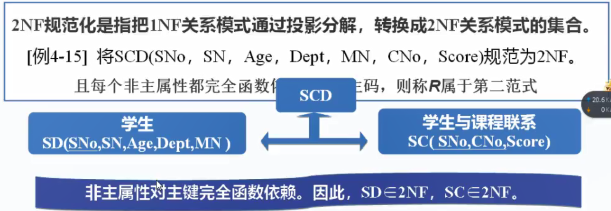
>
> * ==第三范式==
>
>   如果关系模式R⊆2NF, 且每个非主属性都不传递依赖于R的主码, 则称R属于第三范式,简称3NF, 记作R⊆3NF
>
>   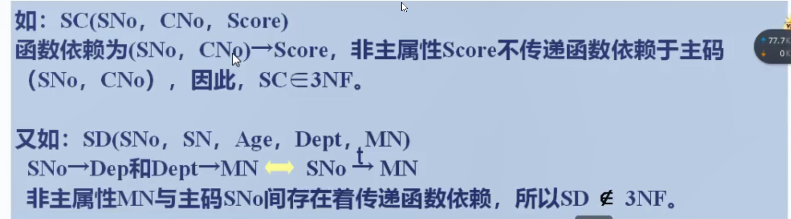

### 小结

> * 函数依赖的概念，其中包括完全函数依赖、部分函数依赖和传递函数依赖。
> * 规范化就是对原关系进行投影，消除决定属性不是候选码的任何函数依赖。
> * 一个关系只要其分量都是不可分的数据项，就可称作规范化的关系，也称作1NF。
> * 消除1NF关系中非主属性对主码的部分函数依赖，得到2NF；
> * 消除2NF关系中非主属性对主码的传递函数依赖，得到3NF;
> * 在规范化过程中，可逐渐消除存储异常，使数据冗余尽量小，便于插入、删除和更新。
> * 规范化的基本原则就是遵循概念单一化“一事一地”的原则，即一个关系只描述一个实体或者实体间的联系。

## 五、数据库设计

> * ==数据库设计的任务==
>
>   数据库设计是指根据用户需求研制数据库结构和行为的过程
>
> * ==数据库设计的内容==
>
>   * 结构设计 --> 概念设计, 逻辑设计和物理设计
>   * 行为设计 --> 应用程序使用数据库的方法
>
> * ==数据库设计的步骤==
>   1. 系统需求分析阶段 确定边界，数据字典
>      * 调查分析用户活动
>      * 收集和分析需求数据,确定边界，数据字典
>      * 编写需求分析报告
>   2. 概念结构设计阶段 表达用户需求的概念模型
>      * 将需求分析得到的用户需求抽象为信息结构, 即概念模型
>      * E-R图
>   3. 逻辑结构设计阶段 由概念模型得出的数据模型
>      * 由局部到全局
>      * 关系模式规范化
>      * 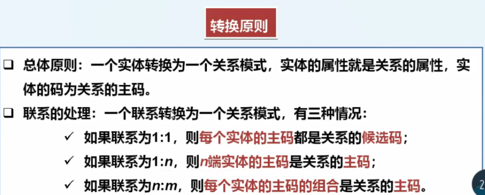
>   4. 物理结构设计阶段 存储结构和存取方法
>      * 面向底层结构
>      * 评价物理结构重点是时间效率和空间效率
>   5. 数据库实施阶段 数据入库，转存到用户系统中
>      * DDL定义数据库结构
>      * 运行测试
>   6. 数据库运行与维护阶段 保持数据完整性
>      * 维护数据库的安全性与完整性：监管权限，调整转储计划。
>      * 监测并改善数据库性能：按照性能监控调整功能，最小化的影响现有业务。
>      * 重新组织和构造数据库：存储位置，回收垃圾，减少指针等

### E-R图

> 矩形: 实体
>
> 椭圆: 属性
>
> 菱形: 联系

### E-R图转成关系模型

> ==转换原则==
>
> * 总体原则：一个实体转换为一个关系模式，实体的属性就是关系的属性，实体的码为关系的主码。
> * 联系的处理:一个联系转换为一个关系模式，有三种情况：
>   * 如果联系为1:1，则每个实体的主码都是关系的候选码;
>   * 如果联系为1:n,则n端实体的主码是关系的主码;
>   * 如果联系为n:m,则每个实体的主码的组合是关系的主码。


 
